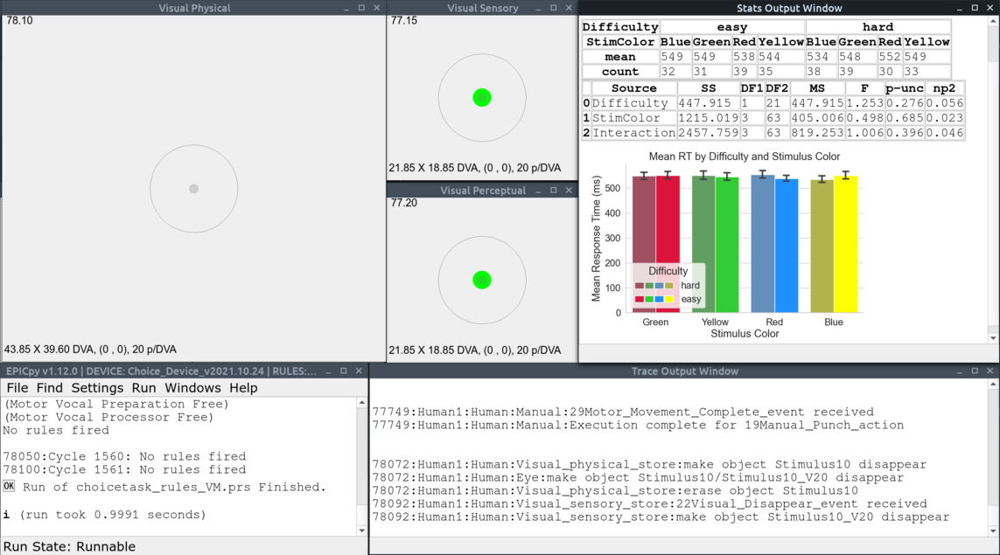

## EPICpy Documentation
Travis L. Seymour, PhD

---

**Background**

EPIC is a computational cognitive architecture that specifies a theory of human performance and a facility to create individual task models constrained by that theory. EPIC compacts decades of psychological theory and findings into a rich set of processors and interactions, including those that model sensory perceptual, motor, cognitive, and memory subsystems of the human mind.

EPIC currently exists as an integration between a computational version of the architecture written in C++ (EPIClib) and a GUI-based simulation environment that uses it, also written in C++ (EPICapp). EPIC only runs on MacOS, and some tasks (e.g., writing virtual tasks, or perceptual encoders) requires knowledge of the C++ programming language.

**What's New**

**EPICpy** is a cross-platform Python-based interface to EPIClib that allows programming task devices and perceptual encoders in the Python programming language. However, EPIClib itself is still coded in C++.

`This repository contains the *source code* for the EPICpy documentation.`

For more information:

* [EPICpy Article](https://joss.theoj.org/papers/10.21105/joss.04533)
* [EPICpy Overview, Binary Installers, Dockerfile, and Sample Tasks](https://cogmodlab.ucsc.edu/2022/03/14/epic/)
* [Detailed EPICpy Documentation](https://travisseymour.github.io/EPICpyDocs/) (The docs in this repository hosted for public use)

Project Sources

* [EPICpy Source Repository](https://github.com/travisseymour/EPICpy)
* [EPICpy Documentation Repository](https://github.com/travisseymour/EPICpyDocs) (this repository)

