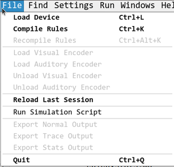
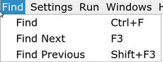
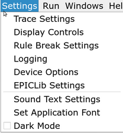
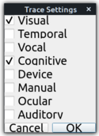
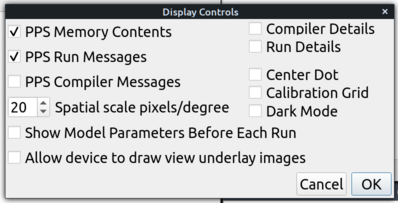
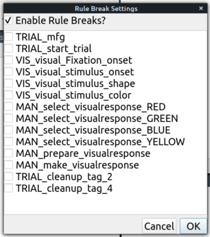
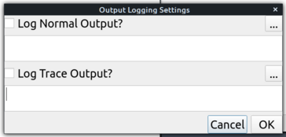
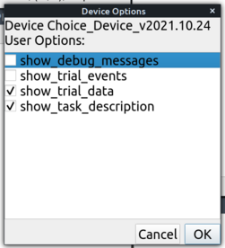
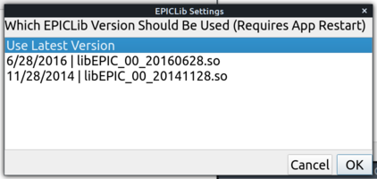
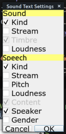

# EPICpy Interface Options, Settings, and Commands

When you first run EPICpy, the graphical user interface (GUI) should look like this:

Regardless of platform `(I think!)`, EPICpy's menu will be found atop the **Normal Output Window**.

## File Menu

- Load Device: Presents a file dialog that allows you to select and load an EPICpy "Device File". Device files define a particular virtual task and are coded in Python.
- Compile Rules: Presents a file dialog that allows you to select and load an EPICpy "Production Rule" text file. Production Rules are written in IF-THEN style according to the Parsimonious Production Rule System [(Covrigaru & Kieras 1995)](resources/articles/CovrigaruKieras1987_ONR_TR26.pdf). The verb "Compile" indicates that after loading this file, EPIC will attempt to evaluate the rules and use them to construct a rule network. Any errors in the rule syntax will be noted in the Normal Output Window.
- Recompile Rules: Compiles the most recently production rule file to have been successfully compiled.
- Export Normal/Trace/Stats Output: Opens a file-save dialog allowing to the contents of the Normal-, Trace-, or Stats- Window to be stored as a file on disk.

## Find Menu

- Find: Launches a dialog (also available by right-clicking the Normal Output Window) that allows simple search of text within the Normal Output Window.
  
## Settings Menu

### Trace Settings Dialog 

 
This dialog allows detailed tracing of various EPIC processors' information during simulation. Relevant output is printed to the Trace Output Window.

### Display Controls Dialog

- **PPS Memory Contents**: Prints EPIC Working Memory (WM) contents to the Normal Output Window during simulation runs.
- **PPS Run Messages**: Prints information about which Production Rules fire during simulation runs, as well as the relevant WM elements that match rules that fired (called "rule bindings").
- **PPS Compiler Messages**: Prints extra diagnostic information when (re)compiling production rules.
- **Spatial scale pixels/degree**: Magnification factor for view windows. Larger values zoom in, smaller values zoom out.
- **Show Model Parameter Before Each Run**: Does as the name suggests, can be useful when saving Normal Output Window content to have an indication of the corresponding EPIC parameterization.
- **Allow device to draw view underlay images**: It is possible for devices to specify images the draw underneath normal Visual- or Auditory View content. This toggle allows such drawing to be enabled/disabled without altering the device code.
- **Compiler Details**: Currently does nothing.
- **Run Details**: Prints detailed information about the operation of PPS during simulation runs. Not often useful, but can be useful for investigating why complex rules are or are not firing.
- **Center Dot**: Toggles the drawing of a small dot on Visual Views to indicate where the center of the view is as other objects move around.
- **Calibration Grid**: Toggles the drawing of a grid overlay across each of the View windows.

### Rule Break Settings Dialog

This dialog shows a toggle for each rule in the current ruleset. Checking a rule will cause the simulation to halt when it fires. The entire rule-break facility can be toggled with the topmost checkbox without altering which individual rules are selected.

### Logging Dialog

Although it is possible to save Normal and Trace Output content after a run, this dialog can be used to set files to automatically receive content for these windows.

### Device Options Dialog

This dialog will present 0 or more checkboxes that allow toggling features of the current device without altering the corresponding code. Note that exposing options for this menu is optional and some devices may not expose any.

### EPICLib Settings Dialog

This dialog indicates the EPIClib versions that are currently available. By default, the "Use Latest Version" setting is selected. However, if one wants to run a simulation that relies on an older version of EPIClib, this dialog can be useful.

### Sound Text Settings Dialog

Sound and Speech objects displayed on the Auditory Views can be adorned with several pieces of information. Note that sounds always show the Timbre and Speech always show the Content.

## Running/Managing Simulations

## Other Options
