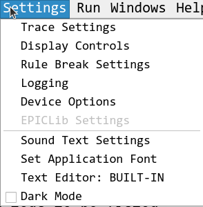

# EPICpy Interface Options, Settings, and Commands

When you first run EPICpy, the graphical user interface (GUI) should look like this:

<!--
TODO: Let's keep this here in case mac users complain and ask for this to return
EPICpy's menu will be found atop the **Normal Output Window** for most platforms, but for MacOS, the menu will be attached to the top of the screen rather than the top of the Normal Output Window. In some cases, you might not see the top-screen menu on MacOS until after you have mouse-clicked inside the Normal Output Window at least once.
-->

## File Menu

- **Load Device**: Presents a file dialog that allows you to select and load an EPICpy "Device File". Device files define a particular virtual task and are coded in Python.
- **Compile Rules**: Presents a file dialog that allows you to select and load an EPICpy "Production Rule" text file. Production Rules are written in IF-THEN style according to the Parsimonious Production Rule System [(Covrigaru & Kieras 1995)](resources/articles/CovrigaruKieras1987_ONR_TR26.pdf). The verb "Compile" indicates that after loading this file, EPIC will attempt to evaluate the rules and use them to construct a rule network. Any errors in the rule syntax will be noted in the Normal Output Window.
- **Recompile Rules**: Compiles the most recently production rule file to have been successfully compiled.
- **Export Normal/Trace/Stats Output**: Opens a file-save dialog allowing to the contents of the Normal-, Trace-, or Stats- Window to be stored as a file on disk.

## Find Menu

- **Find**: Launches a dialog (also available by right-clicking the Normal Output Window) that allows simple search of text within the Normal Output Window.
  
## Settings Menu

### Trace Settings Dialog 

 
This dialog allows detailed tracing of various EPIC processors' information during simulation. Relevant output is printed to the Trace Output Window.

### Display Controls Dialog

- **PPS Memory Contents**: Prints EPIC Working Memory (WM) contents to the Normal Output Window during simulation runs.
- **PPS Run Messages**: Prints information about which Production Rules fire during simulation runs, as well as the relevant WM elements that match rules that fired (called "rule bindings").
- **PPS Compiler Messages**: Prints extra diagnostic information when (re)compiling production rules.
- **Spatial scale pixels/degree**: Magnification factor for view windows. Larger values zoom in, smaller values zoom out.
- **Show Model Parameter Before Each Run**: Does as the name suggests, can be useful when saving Normal Output Window content to have an indication of the corresponding EPIC parameterization. If you are new to EPIC modelling, you should study this output -- the defaults may or may not be relevant for your task, although care should be taken before changing EPIC parameters without sufficient cause.
- **Allow device to draw view underlay images**: It is possible for devices to specify images the draw underneath normal Visual- or Auditory View content. This toggle allows such drawing to be enabled/disabled without altering the device code. Images need to be placed in a folder next to the defice called **images**. Images will only be shown if this setting is ON *and* the task device explicitly calls for them to be drawn.
- **Compiler Details**: Currently does nothing.
- **Run Details**: Prints detailed information about the operation of PPS during simulation runs. Not often useful for most modellers, but can be useful for investigating why complex rules are or are not firing.
- **Center Dot**: Toggles the drawing of a small dot on Visual Views to indicate where the center of the view is as other objects move around.
- **Calibration Grid**: Toggles the drawing of a grid overlay across each of the View windows (may slow down simulation on some systems).

### Rule Break Settings Dialog

This dialog shows a toggle for each rule in the current ruleset. Checking a rule will cause the simulation to halt when it fires. The entire rule-break facility can be toggled with the topmost checkbox without altering which individual rules are selected.

### Logging Dialog

Although it is possible to save Normal and Trace Output content after a run, this dialog can be used to set files to automatically receive content for these windows dynamically during the simulation run (of course, this constant writing to disk may slow down the simulation on some systems).

### Device Options Dialog

This dialog will present 0 or more checkboxes that allow toggling features of the current task device without altering the corresponding code. Note that exposing options for this menu is optional and some devices may not expose any.

### EPICLib Settings Dialog
NOTE: This dialog has been disabled for now -- currently, only the 06/08/2016 version of EPICLib is available.
<!--

This dialog indicates the EPIClib versions that are currently available. By default, the "Use Latest Version" setting is selected. However, if one wants to run a simulation that relies on an older version of EPIClib, this dialog can be useful.
-->

### Sound Text Settings Dialog

Sound and Speech objects displayed on the Auditory Views can be adorned with several pieces of information. Note that sounds always show the Timbre and Speech always show the Content.

### Font Settings Dialog

Although the font used by EPICpy is set, this dialog allows you to set the font size used.

### Text Editor Settings Dialog

Although the font used by EPICpy is set, this dialog allows you to set the font size used.

## Running/Managing Simulations

Once you have your device and rules loaded (an perhaps an encoder or 2), you are ready to run a simulation. The **Run->Run_Settings** menu allows you to view and alter the parameters for running your simulation:

In most instances, you will want to enable the **Run Command Duration** `Run Until Done`, the **Display Refresh** `After Each Step` and the **Text Refresh** `After Every 2 steps`, with a **Real Time Per Step** of `0 msecs(s)`. If you are starting a new run (updated device, ruleset, etc.), you may want to clear out the data using the **[Delete Current Device Datafile]** button and then press [**OK**]. At this point, you are ready to choose the **Run->Run** menu option to start your simulation. The lists below explain the other options available on the Run Settings dialog.

**Run Command Duration**

Run Command Duration allows you to specify the stopping rule for the simulation:

- **Run For**: Specifies a number of simulated milliseconds or a steps to run. You can specify this value in steps (third row from the top) or in milliseconds (first row). Steps are 50 ms in duration, running for 50 ms is equivalent to running 1 step. No matter where you are in the simulation (other than the end), this will run for X more ms. Think of this as asking EPIC to run for a specified simulated time period.
- **Run Until**: Specifies a simulated timestep within the simulation -- when this point has been reached, the simulation halts. If you press Run->Run while already at or past this point, nothing will be done. Think of this as asking EPIC to run until a particular simulated temporal milestone.

**Display Refresh**

As the simulation runs, EPIC will draw any visual or auditory information being represented on the device and in the sensory and perceptual systems on the Physical, Sensory, and Perceptual View windows, respectively. Although updates to these windows are being done quickly, these drawing routines and the information exchange that fuel them can slow down the simulation. In general, when developing a model, it is common to enable display refresh so that you can visually monitor the view windows as the simulation progresses. However, when producing large simulated runs, it will be much faster to disable this graphical output. Here are the options:

- **After Each Step**: This is essentially the normal mode of operation whereby the contents of the device display and EPIC's visual and perceptual processors are depicted in the view windows dynamically as the simulation progresses. This mode is significatly slower than choosing **None During Run**.
- **None During Run**: In this mode, view window updates are completely disabled. When the simulation ends, you _may_ see something drawn on the view windows, but only if there were objects represented in the corresponding processors when the simulation ended.

**Text Refresh**

As the simulation runs, EPIC will produce a decent amount of text -- primarily consisting of a dump of EPIC's Working Memory (WM) after each 50 ms step. These settings allow you to manage how often this text is actually printed to the Normal Output and Trace windows *during* the simulation. The reason you might care is that printing text slows down the simulation somewhat. In general, when developing a model, it is common to enable text refresh so that you can visually monitor the output as the simulation progresses. However, when producing large simulated runs, it will be much faster to disable this text refresh. Here are the options:

- **Continuously**: In this mode, EPICpy will essentially print text to the Normal Output and Trace windows as soon as it is generated,thus you will see text flying by continuously as the simulation progresses. The simulation will be significantly slower in this mode.
- **After Each X Steps**: In this mode, EPICpy will cache printed text and only print it to the Normal Output *after* the specified number of steps. This mode is much faster than the **Continuously** mode.
- **None During Run**: In this mode, EPICpy will cache printed text and only print it to the Normal Output and Trace windows *after* the entire simulation run has finished. This mode will speed up the simulation dramatically compared to the **Continuously** mode. Note that simulations that generate a lot of text (either long runs, and/or runs what a great deal of WM content) may take a few moments to render all the cached text after the simulation finishes.

