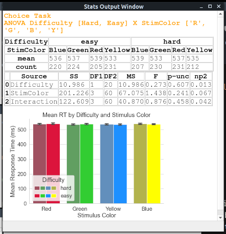

# EPICpy Interface

When you first run EPICpy, the graphical user interface (GUI) should look like this:

## Model View Windows

During simulations, EPICpy allows the modeler to monitor content being represented by 3 key processors within the EPIC architecture; The Physical View, the Sensory View, and the Perceptual View. 

The Physical View depicts the current physical task display and any objects and properties that have been created by the device. This view is not part of the EPIC psychological model, and is the simulated task device with which the psychological model interacts. The Visual Physical View depicts any visual objects and their various objects properties.

**Visual Views During the Williams Task**

For example, the figure above depicts a snapshot from a simulation of the paradigm from [Williams (1967)](resources/articles/williams1967.pdf). On each trial, a large assortment of objects with various colors, shapes, and sizes are displayed in a grid configuration. Prior to this display, participants are asked to locate a particular object (e.g., medium, plus, green) and respond with a button press a soon as they have found it.

**The Physical View**: The Physical View shows all visual information currently being represented on the display of the simulated device. The first panel of the figure above shows the **_Visual_ Physical View** of the Williams Task. Notice that the current gaze position of EPIC is represented by a set of concentric circles. The center-most point of these circles represents the location of EPIC's current gaze point. The small filled grey circle extends to 1 degrees of visual angle (DVA) around this gaze-point. The larger unfilled circle extends to 7.6 DVA. Modellers can use these circles to tell where EPIC is currently "looking". Like a computer monitor, when visual information is drawn on the device's virtual monitor, it is visible immediately on the Visual Physical View. Similarly, when information is removed from the simulated monitor, it is removed immediately from the Visual Physical View. 

**The Sensory View**: The second panel of the figure above shows the _Visual_ Sensory View of the Williams Task. The Sensory View allows the Modeller to monitor which subset of the information displayed on the Visual Physical View is currently being represented by EPIC's ocular system. There is a delay between the time information appears on the device and when it can be represented by the eye, and so information on the Visual Sensory View will lag that on the Visual Physical View. This is also true for information removed from the device, there will be a short delay before it is no longer supported by the visual system.

Note that in this snapshot of the Williams Task, EPIC only class complete information (shape, color, and text) of the shape directly in front of its fovea, partial information (e.g., shape) out to about 7 or so degrees, and beyond that it represents no information. Once the eye moves to a new location, and after appropriate psychological delays, it will only represent ocular information available at that location.

**The Perceptual View**: The third panel of the figure above shows the _Visual_ Perceptual View of the Williams Task. Just as EPIC's sensory system can only represent information available on the virtual display, EPIC's perceptual system can only represent information previously represented by the sensory system. The Visual Perceptual View does not represent the entire contents of Visual Perception (for that one would have to view the Working Memory trace; see below). However, visual object properties such as location, shape, size, relative position, color, text, etc. are depicted here. Although both EPIC's sensory system and its perceptual system maintain information even after it is no longer supported on the device, perceptual information stays around for considerably longer. Because of this, the Visual Perceptual View will show information about many of the objects that have been recently foveated by EPIC's visual system.

**Williams Task In Action** (Slowed Down Greatly)

The video above shows a set of trials of the Williams Task. Notice the temporal dynamics of the 3 view windows; information presented on the display shows up on the Sensory Vision window after a delay, and on the Perception Vision window after another delay. After information is removed from the virtual device, it then disappears from the Sensory Vision window, and then later from the Perceptual Vision window.

**Auditory Views During the Choice Task**

There are also 3 corresponding view windows for EPIC's auditory system. The Auditory Physical View depicts any audio played by the virtual device. These can be sounds from a variety of virtual sources, including speakers, headphones, human speakers, nature, etc., and are represented as either a sound or speech within EPIC. No matter the source, sounds played by the device are depicted as text located somewhere on the 2D space of the Auditory Physical View window. This text contains the name of the sound, the timbre (sounds) or text content (speech), as well as several other pieces of information (e.g., loudness, pitch, etc.). The exact set of information displayed for auditory objects is configurable via the **Settings&#10145;Sound Text Settings** dialog.

In the default Choice Task device, each trial's visual fixation is accompanied by a computerized speech sound of the word "Warning". This is denoted by `Speaker: Computer, Content: Warning, Kind: Speech`. Each trial's stimulus is accompanied by a non-speech sound with a Timbre dependent on the stimulus eccentricity (in this case, "Beep"). This is denoted by `Timbre: Beep, Stream: Signal, Kind: Sound`. This particular output for both speech and sound objects is a subset of what is available in the **Settings&#10145;Sound Text Settings** dialog. For example, this particular output is achieved with the following setting:

Note that Timbre and Content are grayed out because they cannot be disabled for sounds and speech, respectively.

## Normal Output Window

Then **Normal Output Window** is the primary source of information when using EPICpy. Text printed to this window conveys the output of various menu operations, e.g., this is the result of loading the Choice Task device and ruleset:

Any EPIClib or EPICapp errors, will also be printed to the Normal Output Window. E.g., the following results from a production rule formatting error:

While running a simulation, the Normal Output Window often displays a running trace of EPIC's Working Memories for each simulated 50ms step. E.g.:

## Trace Output Window

The **Trace Output Window** is used to monitor the detailed operation of various EPIC processors. By default, the Trace Output Window will be dormant, but tracing of various processors can be enabled using the **Settings&#10145;Trace Settings** dialog. For example, the following configuration will enable tracing of EPIC's visual and auditory processors:

As a result, the following may be viewed during a simulation run:

## Stats Output Window

The **Stats Output Window** content is entirely dependent on the device. Some devices may not use this window, others may use it to show text, tables, figures, and other depictions of a model's performance. Typically, the Stats Output Window will be updated only occasionally (for example, after a simulation run). More frequent updates will significantly slow down the simulation. The following shows a possible output following several runs of the Choice Task model:

## Window Positioning

By default, the window layout of EPICapp is as follows and appears on the first monitor available:

If this layout is altered by closing, moving, or resizing windows, **_when no device is loaded_**, the default window layout will be updated and remembered when EPICapp is next loaded. To return to the default layout, use the menu option **Windows&#10145;Restore Default Layout** and then close EPICpy.

If the layout is altered by closing, moving, or resizing windows **_while a device is loaded_**, then that layout will be reinstated the next time that device is loaded. Again, to restore the default layout for a particular device, just load that device and then choose **Windows&#10145;Restore Default Layout**.

E.g., the following is an example custom layout for the Choice Task device:

