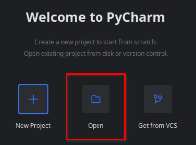
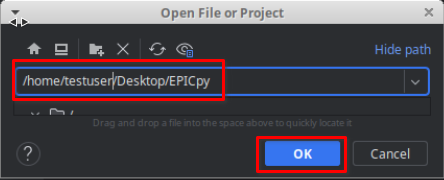
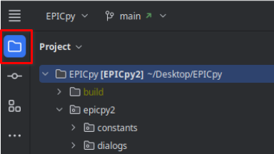
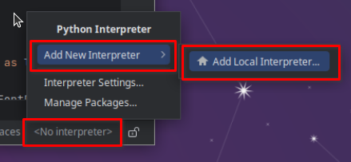
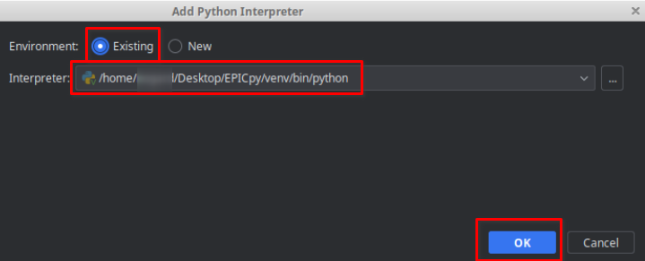
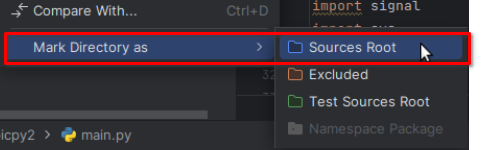
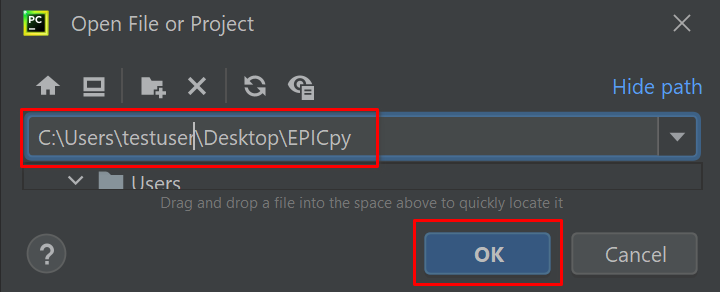
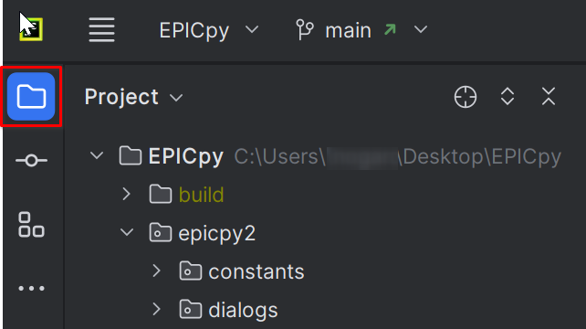

# EPICpy Development

## Overview

EPICpy is developed using the following technologies:

**Require Python Versions**

Version 3.9.16 on Windows
Version 3.10.11 on Linux and MacOS

Why these versions? The upper limit is 3.10 because some modules we use are not currently rewritten for Python 3.11 or are not sufficiently stable. When this changes, the version will be switched to 3.11 on MacOS and Linux. On Windows, the supported Python version is 3.9 because AFAIK, Microsoft Visual Studio 2019 built in Python (required at the moment to build EPICLib with PyBind11) is limited to 3.9. Our goal is to switch to the latest version of MSVS shortly which may support Python 3.10 and allow EPICpy to run with Python 3.10 on Windows.

**Key Packages**

- [PyBind11](https://github.com/pybind/pybind11) (pybind11): Library for generating Python bindings for existing C++ code. We are currently using this to produce a Python3.9 compatible library of EPIClib for Windows and a Python3.10 compatible library for MacOS and Linux.
- [PySide2 GUI Framework](https://wiki.qt.io/Qt_for_Python) (pyside2): Used to build the Graphical User Interface. _Note: We are momentarily using PyQt5 instead of PySide2, but this will change shortly and allow for an overall more permissive license for EPICpy_.
- [Pingouin Stats System](https://pingouin-stats.org/) (pingouin): Meta-package providing access variety of statistical and graphing packages.
- [PipX](https://github.com/pypa/pipx) (pipx): Allows easy cross-platform distributing Python applications.

<hr>

## Setup Dev Environment

### Linux

#### Tested on these Linux Variants

- [x] Debian-based Linux variants (e.g., Ubuntu, Mint, PopOS, etc.)
- [ ] Redhat-based Linux variants (e.g., Redhat, Fedora, Centos, etc.)
- [ ] Arch-based Linux variants (e.g., ArchLinux, Manjaro, EndeavourOS, etc.)

Tested on these Linux Versions:

- [x] 18.04
- [x] 20.04
- [x] 22.04

Most recent Linux distributions come with Python 3 already installed, so you probably already have Python. However, you will need to make sure you build your virtual environment using Python 3.10. In particular, adjust the path of the `python3 -m venv venv` command below so that it points to the correct version of Python (or use your own method to create the proper virtual environment). If you need help managing and locating various versions of Python, see this section: [Installing Python With PyEnv](installing_python_with_pyenv.md).

#### Install Prerequisites

If you haven't already installed them (e.g., if you [previously installed PyEnv](installing_python_with_pyenv.md), then you already have these), you should install the following:

```bash
sudo apt install build-essential libssl-dev libffi-dev libncurses5-dev zlib1g zlib1g-dev libreadline-dev libbz2-dev libsqlite3-dev make gcc curl git
```

You will also need to install the PyQt5 Development files:

```bash
sudo apt install qtbase5-dev
```

#### Retrieve Source Files from GitHub

```bash
# note: this will create the EPICpy source folder in the directory from which you type these commands: 
git clone https://github.com/travisseymour/EPICpy
cd EPICpy
```

#### Set Up A Virtual Environment

NOTE: this section assumes you already have Python 3.10 on your machine and know the path or command required to start it.  If not, see the [Installing Python with PyEnv](installing_python_with_pyenv.md) section.

###### Set up a Virtual Environment Using Python 3.10

Create the virtual environment

```bash
cd EPICpy
# vvv replace with path to your copy of Python 3.10
~/.pyenv/versions/3.10.11/bin/python3 -m venv venv
```

Activate the virtual environment

```bash
source venv/bin/activate
```

Check it

```bash
python -V
```

This should report `Python 3.10.x`

###### Install Dependencies

Activate the virtual environment

```bash
source venv/bin/activate
```

Update Python package manager

```bash
# update pip  and wheel
pip install -U pip wheel
```

Install the EPICpy Python requirements

```bash
# install EPICpy requirements
pip install -r requirements.txt
```

#### Setup EPICpy in Your Python IDE

The following assumes you are following along with the [PyCharm Integrated Python Development Environment](https://www.jetbrains.com/pycharm/). For others (e.g., VSCode, Sublime, etc.) should modify the instructions accordingly.

###### Obtain PyCharm's Free Community Edition IDE

```bash
# If you like using Canonical's proprietary Snap Linux app installer
# To install snap https://itsfoss.com/install-snap-linux/
sudo snap install pycharm-community --classic

# If you like to live the FOSS way using the Flatpak Linux app installer
# To install flatpak https://itsfoss.com/flatpak-guide/
flatpak install com.jetbrains.PyCharm-Community
```
   
###### Start PyCharm

###### Open The EPICpy folder as a new PyCharm Project




###### Open The File Viewer



###### Set Up The Interpreter

Click on the **\<NoInterpreter\>** button in the bottom right of the IDE, choose **AddNewInterpreter**, then **AddLocalInterpreter**:



Choose **Existing**, make sure the **Location** field contains the path to the Python 3.10 virtual environment (`venv` folder) you created earlier and press **OK**:



###### Set The Sources Root

Set the Sources Root by right-clicking on the `epicpy2` folder and choosing **MarkDirectoryAs-->SourcesRoot**.



#### Run EPICpy

Finally, right-click the file `main.py` and choose **Run main**

If all goes well, you should be looking at the EPICpy GUI.

<hr>

### MacOS

##### Tested on these Apple Chipsets:

- [x] Intel
- [ ] M1
- [ ] M2

Tested on these MacOS Versions:

- [x] 10.15 Catalina
- [ ] 11 Big Sur
- [ ] 12 Monterey

Most recent MacOS distributions come with Python 3 already installed, so you probably already have Python. However, you will need to make sure you build your virtual environment below using Python 3.10. In particular, adjust the path of the `python3 -m venv venv` command below so that it points to the correct version of Python (or use your own method to create the proper virtual environment). If you need help managing and locating various versions of Python, see this section: [Installing Python With PyEnv](installing_python_with_pyenv.md).

#### Install Prerequisites

You will need to install the XCode commandline build utilities. A super easy way to do this is to just install the Homebrew package manager. You may have already done this, if not see the section on [Installing a Package Manager](installing_a_package_manager.md). Another approach is to install XCode (it's a 10GB download, and you'll need an additional 10GB of space to install it) from the Apple Store and then use XCode to install the commandline utilities. This is challenging if you don't have the latest version of MacOS, as the version of XCode in the Apple Store may not be installable. Generally, I strongly recommend [installing Homebrew](installing_a_package_manager.md); not only does it install the build tools you need, but it's much faster than installing XCode, will install on any version of MacOS. Besides, having Homebrew is super useful anyway. If you already have XCode installed, you may be good to go.

#### Retrieve Source Files from GitHub

```bash
# note: this will create the EPICpy source folder in the directory from which you type these commands: 
git clone https://github.com/travisseymour/EPICpy
cd EPICpy
```

#### Set Up A Virtual Environment

NOTE: this section assumes you already have Python 3.10 on your machine and know the path or command required to start it.  If not, see the [Installing Python with PyEnv](installing_python_with_pyenv.md) section.

###### Set up a Virtual Environment Using Python 3.10

Create the virtual environment

```bash
cd EPICpy
# vvv replace with path to your copy of Python 3.10
~/.pyenv/versions/3.10.11/bin/python3 -m venv
```

Activate the virtual environment

```bash
source venv/bin/activate
```

Check it

```bash
python -V
```

This should report `Python 3.10.x`

###### Install Dependencies

Activate the virtual environment

```bash
source venv/bin/activate
```

Update Python package manager

```bash
# update pip  and wheel
pip install -U pip wheel
```

Install the EPICpy Python requirements

```bash
# install EPICpy requirements
pip install -r requirements.txt
# If you have an fbs pro install command, run that now. It can also be upgraded later if you purchased fbs pro (optional).
```

#### Setup EPICpy in Your Python IDE

The following assumes you are following along with the [PyCharm Integrated Python Development Environment](https://www.jetbrains.com/pycharm/). For others (e.g., VSCode, Sublime, etc.) should modify the instructions accordingly.

###### Obtain PyCharm's Free Community Edition IDE

```bash
brew install --cask pycharm-ce
```

###### Start PyCharm

###### Open The EPICpy folder as a new PyCharm Project 


###### Open The File Viewer


###### Set Up The Python Interpreter

Click on the **\<NoInterpreter\>** button in the bottom right of the IDE, choose **AddNewInterpreter**, then **AddLocalInterpreter**:


Choose **Existing**, make sure the **Location** field contains the path to the Python 3.10 virtual environment (`venv` folder) you created earlier and press **OK**:


###### Set Sources Root

Set the Sources Root by right-clicking on the `epicpy2` folder and choosing **MarkDirectoryAs-->SourcesRoot**.


#### Run EPICpy

Finally, right-click the file `main.py` and choose **Run main**

If all goes well, you should be looking at the EPICpy GUI.

<hr>

### Windows

#### Tested on these Windows Versions:

- [x] 10
- [ ] 11

Although Windows doesn't ship with Python 3 already installed, you may have previously installed Python. However, you will need to make sure you build your virtual environment below using Python 3.9. In particular, adjust the path of the `python3 -m venv venv` command below so that it points to the correct version of Python (or use your own method to create the proper virtual environment). If you need help managing and locating various versions of Python, see this section: [Installing Python With PyEnv](installing_python_with_pyenv.md).

#### Install Prerequisites

Windows doesn't come with `git` installed. You will need git to obtain the EPICpy files from the software repository on GitHub.com.

If you've installed the Chocolatey package manager, then you can just enter this command:

```bash
choco install git
```

If you don't have Chocolatey, you can install it using the instructions in the [Installing A Package Manager](installing_a_package_manager.md) section.

#### Retrieve Files from GitHub

```bash
# note: this will create the EPICpy source folder in the directory from which you type these commands: 
git clone https://github.com/travisseymour/EPICpy
cd EPICpy
```

#### Set Up A Virtual Environment

NOTE: this section assumes you already have Python 3.10 on your machine and know the path or command required to start it.  If not, see the [Installing Python with PyEnv](installing_python_with_pyenv.md) section.

###### Set up a Virtual Environment Using Python 3.10

Create the virtual environment

```bash
cd EPICpy
# vvv replace with path to your copy of Python 3.10
C:\Users\testuser\.pyenv\pyenv-win\versions\3.9.13\python.exe -m venv venv
```

Activate the virtual environment

```bash
venv/Scripts/activate
```

Check it

```bash
python -V
```

This should report `Python 3.9.x`

###### Install Dependencies

Activate the virtual environment

```bash
source venv/bin/activate
```

Update Python package manager

```bash
# update pip  and wheel
pip install -U pip wheel
```

Install the EPICpy Python requirements

```bash
# install EPICpy requirements
pip install -r requirements.txt
```

#### Setup EPICpy in Your Python IDE

The following assumes you are following along with the [PyCharm Integrated Python Development Environment](https://www.jetbrains.com/pycharm/). For others (e.g., VSCode, Sublime, etc.) should modify the instructions accordingly.

NOTE: The command below assumes you've installed the Chocolatey package manager. If you do not, then you can install it using the instructions in the [Installing A Package Manager](installing_a_package_manager.md) section.

###### Obtain PyCharm's Free Community Edition IDE

```bash
choco install pycharm-community
```

###### Start PyCharm

###### Open The EPICpy folder as a new PyCharm Project 




###### Open The File Viewer



###### Setup UP Python Interpreter

Click on the **\<NoInterpreter\>** button in the bottom right of the IDE, choose **AddNewInterpreter**, then **AddLocalInterpreter**:


If instead of \<NoInterpreter\> it says "Python3.9(EPICpy)" then PyCharm has already found and correctly installed your virtual environment! Otherwise, continue setting up the interpreter:

Choose **Existing**, make sure the **Location** field contains the path to the Python 3.10 virtual environment (`venv` folder) you created earlier and press **OK**:


###### Set Sources Root

Set the Sources Root by right-clicking on the `epicpy2` folder and choosing **MarkDirectoryAs-->SourcesRoot**.


#### Run EPICpy

Finally, right-click the file `main.py` and choose **Run main**

If all goes well, you should be looking at the EPICpy GUI.

<hr>

