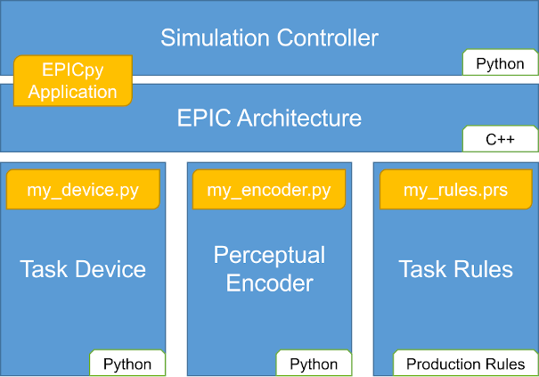
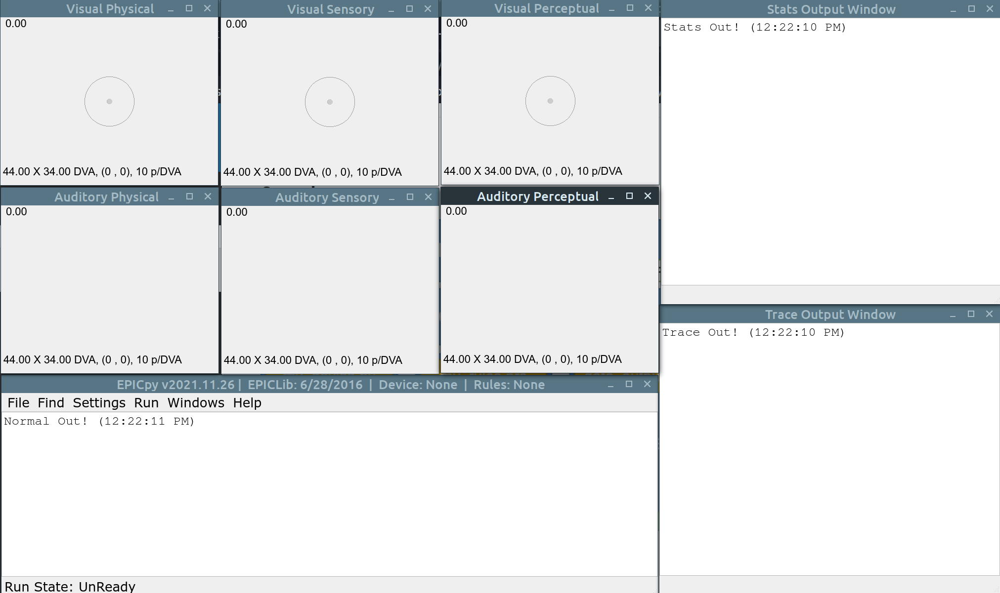

# EPICpy Simulation Components

This page describes of what it means to simulate human performance using EPIC under EPICpy, by going over each of the key components of a simulation run. For an overview of what EPIC and EPICpy are, and what they are used for, see the [Home Page](index.md) page. To see an example simulation walkthrough, see the [Epic Simulation Example](example.md) page.

**Figure 1**

Executive-Process/Interactive-Control (EPIC) is a Cognitive Architecture created by David Kieras and David Meyer. EPIC describes both an integrated theory of human performance and a computational approach to using that system to simulate human behavior. Detailed description of the EPIC architecture as a theory of human performance, and examples of how it can be applied to answering various psychological questions can be found at [https://web.eecs.umich.edu/~kieras/epic.html](https://web.eecs.umich.edu/~kieras/epic.html) (also see the [EPIC Resources](epicresources.md) page). EPIC itself is written in C++, but cannot be used directly. Instead, you need some control software that allows you to configure and manage simulations using EPIC. Previously, EPIC the architecture was combined with EPICapp, the GUI-based control software, also written in C++. This combination can be found at [https://github.com/dekieras/EPIC](https://github.com/dekieras/EPIC) (requires MacOS with XCode installed).

Using EPICpy, Like EPICapp before it, generally involves the components shown in Figure 1, expect that some elements are now written in Python rather than C++:

## EPICpy Application

The EPICpy Application contains both an interface to EPIC architecture (copied directly from the code [C++ code](https://github.com/dekieras/EPIC) maintained by its creator.), which one only accesses through Task Device programming. The EPICpy Application also offers a GUI for managing a simulation run. When launched, the EPICpy GUI will look similar to Figure 2:

**Figure 2**

Notice that there are 3 windows for Vision, and 3 windows for Audition. For each modality, there is the Physical window (a depiction of what's on the Task Device display screen), a Sensory Window (a depiction of what information is currently being represented within the sensory processors), and a Perceptual Window (a depiction of what information is currently represented within the perceptual processors).

There is also the **Normal Output** window that shows most information about the simulation status, errors, etc. It also shows a continual trace of the current contents of EPIC's Working Memory (updated every 50 ms).

The **Trace Output** window shows detailed trace information for various EPIC processors, but only if they are enabled in the settings. By default, no trace information will be displayed.

The **Stats Output** window shows any statistical analysis information written by the device and can include text, tables, and graphs.

EPICpy's GUI allows setting various general options via the **Settings** menu, as well as various model-specific options via the Settings and Run menus.

The GUI also facilitates loading Task Devices, Task Rules, and Perceptual Encoders, which together represent a single psychological model for simulation.

## Task Devices

The **File&#10145;Load_Device** menu item is used to load a **Task Device** into the simulation environment. A task device is a Python code file that represents a simulated performance environment that EPIC (the simulated human performer) will interact with. The device represents the hardware and software that users interact with, and can visual and auditory stimuli, manual and vocal response devices, and task logic. Thus, the task device controls the progression of a task and dictates how it handles inputs and output.

For example, researchers may run human participants in trials of a task using a computer monitor and speakers to display stimuli and warnings, as well as a keyboard to register responses. Data from this human run would be collected and stored. To understand performance in such a task, researcher might produce a hypothesis based on theory or performance in similar tasks. They may wish to test their hypothesis fo how humans performed this task by simulating that performance. The task device would be constructed to mimic the human task device (again, including all relevant inputs and outputs, as well as corresponding data collection). The task device would be programmed to sufficient detail to serve as a reasonable test of the hypothesized performance strategy, but may omit details deemed insignificant. E.g., your hypothesized model for how one uses a word processor may omit representation of the web camera affixed to the top of the monitor if the presence of that camera has no significant effect on task performance. Similarly, one might omit texture and shading in a model of driving performance, if these visual details are deemed irrelevant. Of course assumption about what to include, or exclude from the simulated task device could be incorrect, which is why such assumptions are effectively a part of the psychological model being tested.

Currently, EPIC (the architecture) allows flexible object-based representations of visual and auditory stimuli (arbitrary sounds and speech) localized in space relative to the simulated performer. EPIC also allows a number of manual response devices (e.g., response-box, keyboard, joystick, mouse movement, etc.) each with multiple response styles. EPIC also supports ocular movements and vocal responses. Thus, these inputs and outputs are the ones available to task devices.

For information on how to program EPICpy devices, see [Programming Overview](model_programming.md) section.

## Perceptual Encoders

Although EPICpy does not provide a way for modelers to alter EPIC itself (the architecture which is programmed in C++ and imported into EPICpy as a compiled, shared library), there is a way to write Python code that alters perceptual processing within EPIC. A Perceptual Encoder is a set of Python code that represents a psychological model for how some subset of a task's visual stimuli are encoded into EPIC's Working Memory following sensation and early perceptual processes, but prior to Worming Memory representation. 

For example, if a furniture novice is shown a display containing a number of furniture items, these objects may be encoded into working memory as ["chair", "table", "sofa", "lamp"]. A furniture expert may have enough experience that they instead perceive the same visual items as ["Eames", "VanDerRohe", "KnollBassett", "Arco"]. This transformation could be embodied in a Visual Encoder. Other visual encoders may make adjustments for participants with red-green color blindness, or add error to object spatial localization due to lack of experience or fatigue. Thus, an encoder translates or alters perceptual information before it is added to EPIC's Working Memory. EPIC also allows Auditory Encoders that do the same kind of transform but for auditory information. For example, an auditory encoder could be used to represent how people mis-hear certain words, or mis-localize certain sounds. Similarly, an auditory encoder can be used to perceive tones of 440, 880, and 1600 Hertz and perceive them as 'high', 'medium', and 'low'.

EPICpy allows the simultaneous use of Visual and Auditory encoders. Encoders can be loaded using the **File&#10145;Load_Visual_Encoder**, and **File&#10145;Load_Auditory_Encoder** menu items. These items are only accessible __after__ a device has been loaded. On subsequent device loads, EPICpy will ask if you would like to automatically re-establish previously used encoders.

For information on how to program EPICpy encoders, see [Programming Overview](model_programming.md) section.

## Task Rules

Whereas the Task Device simulates the task performance context (inputs, outputs, sequence, data collection and scoring, stopping rules, etc.) the Task Rules represent a strategy for performing the task. These rules can either represent conscious strategies one uses to follow task rules and meet task goals, or non-conscious cognitive processing that occurs during task performance.

Task Rules are written generally in a format consistent with other "Production Rules" used in other simulation systems. However, the specific syntax and grammar EPIC expects is defined as part of the Parsimonious Production System (PPS) by David Kieras (2004). To learn how to read/write production rules in EPIC, one can read the [EPIC Principles of Operation (2004)](resources/articles/EPIC_Principles_of_Operation_2004.pdf) by David Kieras. Although unnecessary for most modelers, to dive deeper and understand how PPS works you can read [PPS: A Parsimonious Production System (1987)](resources/articles/CovrigaruKieras1987_ONR_TR26.pdf) by Arie Covrigaru and David Kieras.

Task rules are loaded using the **File&#10145;Compile_Rules** menu item. Rule files are typically plain text files with a **.prs** file extension. Rule files may contain any number of production rules, each with a simple IF/THEN organization. The IF section contains a set of clauses. If each of these clauses is true for the contents of EPIC's WM when evaluated, the rule will "fire", that is cary out each of the commands in the THEN section. For example:

    (VIS_visual_Fixation_onset
    If
    (
        (Goal Do detection_task)
        (Step Waitfor Visual_Fixation_Onset)
        (Visual ?a Detection Onset)	
        (Motor Ocular Processor Free)
    )
    Then
    (
        (Send_to_motor Ocular Perform Move ?a)
        (Add (Tag ?a Fixation_Symbol))
        (Delete (Step Waitfor Visual_Fixation_Onset))
        (Add (Step Waitfor Visual_Stimulus_Onset))
    ))

Rule files also contain other information that are not rules, but configuration information for EPIC. E.g.:

### Initial WM Contents

The modeler may optionally specify some content to be added to WM prior to simulation start using the `Define Initial_memory_contents` command. E.g., at the top of the rule file, on might include this line:

    (Define Initial_memory_contents (Goal Do detection_task))

### EPIC Simulation Configuration

In order to configure various aspects of EPIC's motor, sensory, and perceptual system, directives may be included at the top of a production rule file in a `Define Parameters` clause. E.g.:

    (Define Parameters
        # Specify distribution governing visual perceptual recoding rate
        (Visual_perceptual_processor Recoding_failure_rate1 Fixed 0.5)
        
        # Specify distribution governing manual motor accuracy
        (Manual Execution_fluctuation_factor Normal When_used 1.0 0.1)
        
        # Specify distribution visual sensory delays
        (Eye Property_delay_fluctuation_factor Normal When_used 1.0 0.1)
    )

Why would you want to alter the way EPIC's processors work when creating a simulation to model performance in a particular task? EPIC (the architecture) is programmed with various default parameters. E.g., perception of text by default occurs without error roughly 100 ms after sensation with very little temporal variation. Imagine this default was based on previous work using 12 point Arial font in black ink on a white display from 40 cm away. This default could be inappropriate for the task device you are using. E.g., a task using 8 point text written in medium gray ink on a light gray background, may result in slower perceptual encoding times, and greater encoding error and may require precise foveation to see. You can reflect this visual reality in the Define Parameters section. On the other extreme, imagine a task with 72 point font written in high contrast. It may be faster and less error-prone to encode such a stimulus. This section can also be used to specify the distribution parameters for availability functions. Availability functions dictate the probability that a perceptual property (e.g., color) will be represented by EPIC's ocular processor as a function of foveal eccentricity.

For detail on EPIC parameters and availability functions, including how to specify them, see Kieras's [EPIC Principles of Operation (2004)](resources/articles/EPIC_Principles_of_Operation_2004.pdf).

### Named Locations

A third common directive modelers place at the top of their rules file sets up Named Locations. These named locations can be referred to in rules in order to, for example, direct eye movements or mouse responses. If you give participants instructions that refer to "the center of the screen", "the menu area", etc., their strategy to perform the task may be in reference to these named locations. To specify named locations, the `Define Named_location` directive is used, e.g.:

    (Define Named_location Center_screen 0.0 0.0)

## Putting It All Together

So, an EPIC simulation involves a Task Device that represents a virtual version of a task. On each trial of the task, EPIC's behavior is dictated by the content of the Task Rules. Operation of EPIC itself can be influenced by some combination of perceptual encoders and parameter directives. 

EPIC operates on 50 ms cycles; every 50 ms the contents of WM are compared to each rule in the rule file, any and all rules that match the current state of WM will fire and update WM and/or initiate some motor movement. This continues until the task is done, or nothing happens for a predetermined number of cycles (1000 by default). At the end of your simulation, the device would store any relevant data produced by EPIC (e.g., virtual response times, errors, mose movements, keyboard keys pressed, etc.). This virtual data can then be compared to the previously collected human data. If these data match closely, the strategy represented by the rule file is supported. If the data do not match, the hypothesized strategy may be incorrect.

The approach described above is a post-hoc way of using EPIC (human data first, generate hypothesized strategy after analyzing data, then verify understanding using an EPIC simulation). EPIC can also be used to do predictive modeling whereby simulated data is produced first, and then the generalizability of the corresponding production rules can be assessed by comparing data from later human participants. This might be more useful in a design context. E.g., EPIC may be used to iterate through various cockpit interface changes until reasonable virtual performance is observed. Then a physical mockup of the task device can be created for testing humans.

Note that whereas device programs always specify stimuli to present to EPIC and response handlers to deal with responses EPIC makes, nothing else is guaranteed. This means that the kind of feedback, data storage, or post-task data analysis that is available is entirely up to the device programmer. Typically, devices represent a number of task trials (sometimes within a block structure), and records and stores trial-by-trial data to disk. In EPICpy, this will be stored in a file called data_output.csv within the same folder in which the device file is located. However, device programmers can decide whether to make use of this file, and may sometimes store other data files. Some devices present basic (often quite minimal) statistical analysis at the end of each run for quick verification of model performance. Often this analysis is quite minimal and may simply indicate mean RT and number of correct responses. Sometimes more involved analyses are done using some basic facilities defined within the EPIC architecture (e.g., RMSE calculations). EPICpy has greatly expanded the type of analyses that can be done without reinventing the wheel by allowing model programmers to use the rich set of statistical and graphing packages available for statistics and graphing in Python. For more detail of the statistical facility in EPICpy, see the section on [EPICpy's Stat Window](epicpystats.md).

