# EPICpy Simulation Example

EPICpy comes with 2 sample devices, a [Donders-style Choice Task](resources/articles/modern_mental_chronometry_meyer_et_al_1998.pdf), and a device based on the [Experiment 5 paradigm from Findlay (1997)](resources/articles/findlay_1997_saccade_target_selection_during_visual_search.pdf). Please note that these devices are for demonstration purposes only and the production rules provided may not represent serious psychological models of human performance (especially the Choice Task device).

Consider the Choice Task.

## The Choice Task

### Overview

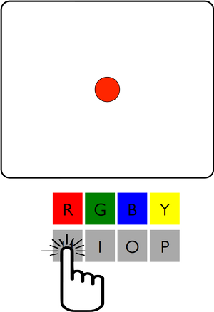

This task asks participants to perform many trials. On each trial, a central warning symbol will be shown for 1000 ms, in this case the octothorpe/number-sign/hash symbol (#). This warning is used to indicate that the stimulus will be displayed next, and to encourage a central ocular fixation. Next the screen is blank for a randomly chosen duration between 500 and 1300 ms. After this period, a 2o diameter colored circle (the stimulus) is shown centered vertically on the display. On each trial, the horizontal eccentricity can vary randomly according to a uniform distribution. The horizontal offsets will either be -2o, -1o, 0o,  1o,  or 1o relative to the center of the display. Note that this is the "**Hard**" condition. There is also an "**Easy**" condition where the stimulus is always displayed in the center of the screen. Stimulus color is randomly chosen each trial from the color set, which can be set between 1 and 4. The full set of task colors is Red, Green, Blue and Yellow. Responses for Red, Green, Blue, and Yellow stimuli are made by pressing the U, I, O, and P keys on the keyboard using the Index, Middle, Ring, and Little fingers on participants' right hand, respectively. After the stimulus is presented, the task waits until a response is made before continuing. On each trial, response time (in milliseconds) and response accuracy are recorded and saved to disk. Between trials there is a 2500 ms delay before starting the next trial.

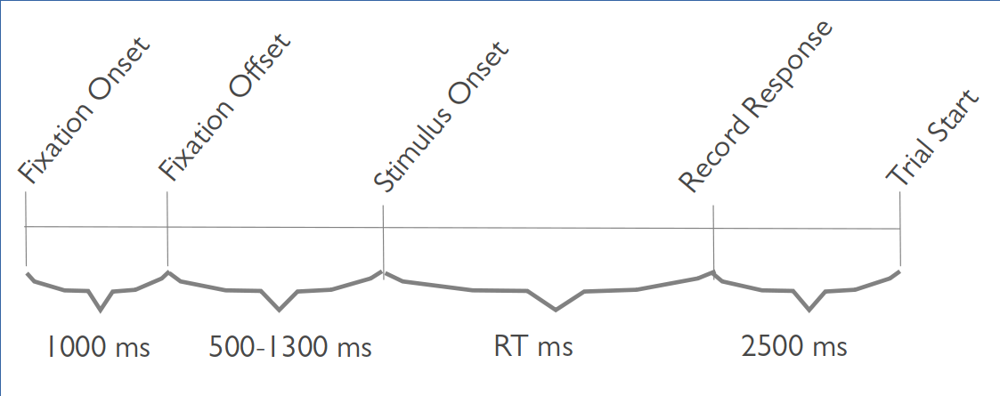

**Choice Task Events**

### Human Data

The figure below depicts some data one might observe when testing humans in the choice task described above ("Easy" condition, i.e., stimulus is always presented at screen center):

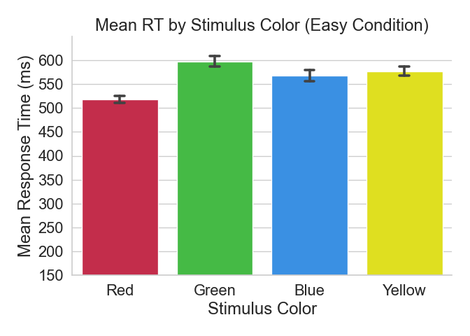

**Choice Task Human Data**

Based on the figure above, we can conclude that participants can generally make these choice responses in around half a second, with red being a little faster and green being a little slower than the others. Why is this? We'll come back to this question later. For now, let's consider a logically minimal strategy for this task in the form of a set of production rules.

### An EPIC Model of the Human Data

The **choicetask_rules_VM.prs** file include with the choice task demo device, and located in the **rules** subfolder. These rules embody a strategy for how participants might perform this task based solely on what is minimally required to follow task instructions:

* Participants first wait for a visual object to appear at display center, at which point they make a mental note that this object must be the fixation symbol they were expecting. They then begin waiting for the stimulus to arrive.
* Participants wait for a different visual object to appear at display center, at which point they look at it and make a mental note that this object must be the stimulus they were expecting. They then begin waiting to become aware of the object's color.
* Participants wait for the object's color, when this information arrives in WM (i.e., they become consciously aware of it), they make a note that they need to press the key associated with this particular color
* Assuming their hands are not currently busy doing anything else, participants subsequently plan a motor movement on their right hand corresponding to the color-key mapping they learned during the instructions. For example, if the stimulus is Red, they will initiate a movement with their right index finger to press the U key on the keyboard. The entire mapping is the keys UIOP for the colors RGBY, respectively.
* Once the manual response has been initiated, participants begin waiting for the next trial to begin.

The following is a process model for the minimal ruleset:

[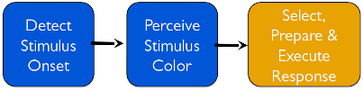](resources/images/choice_task_easy_process_diagram_v1.png)

**Initial Model Process Diagram**

To run this model and see how well it fits (i.e., matches) our human data, we need to do the following:

1. Start EPICpy
2. Use **File&#10145;Load_Device** to load the Choice Task device (**choice_device.py**)
3. Use **File&#10145;Compile_Rules** load the Choice Task Visual-Manual ruleset (**choicetask_rules_VM**)
4.Press **Run&#10145;Run_Settings** to set up the device condition string to match the conditions under which our human data were collected. This would require the string `"80 4 Easy [r1|r2|r3|r4|r5|r6|r7|r8|r9|r10]"`, which indicates 80 trials per simulated run, a maximum of 4 possible colors, the Easy condition (stimulus always in screen center), and 10 runs named r1...r10 in the datafile.
4. On the **Run_Settings** dialog, press the **Delete_Current_Device_Datafile** button to clear the data file (in case there already some data from a previous run).
5. Use **Run&#10145;Run** to start the simulation (this will take some time to run, even on faster machines unless you disable put the **RUN_SETTINGS** in fast-mode (only update text output and view windows *after* the run finishes)).

The result of this simulation are compared to the human data in the following figure:

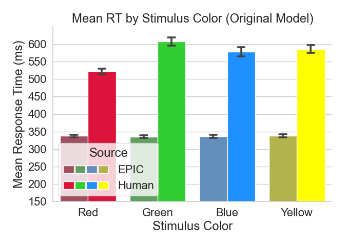

First Run Comparison of Human and Simulated Data

According to this graph, the simulated data appears to represent significantly faster responses than observed in human subjects. Furthermore, it appears that stimulus color is less affected in the simulated data than in the human data. In other words, the fitness (aka "fit") between the human and simulated data is quite poor. This likely means that the performance strategy represented by our production rules is a poor model for the way humans performed the task.

### Coming Up With A Better Model

At list point, let's consider a more psychologically plausible theory for choice task performance:

[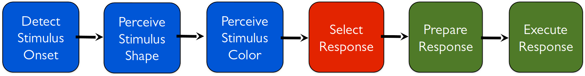](resources/images/choice_task_easy_process_diagram_v2.png)

**Modified Model Process Diagram**

The default rules provided with the choicetask are just a minimal strategy, and not intended to be psychological realistic. Here we add 2 important changes:

**1. Perceptual Rule Changes**: The human data are from humans with only minimal practice, thus it is reasonable to assume that stimulus-response mapping is still in the declarative stage, and not yet automatized. To implement this, we will edit the rules so that response-selection and response-execution are separate stages. 

For example, we might make these changes to the rules:

**Original Perpetual Rules**

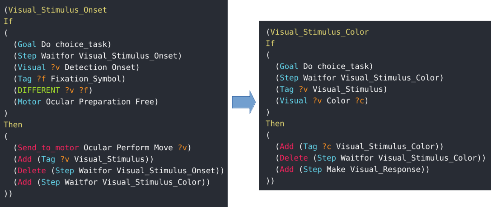

**New Perpetual Rules**

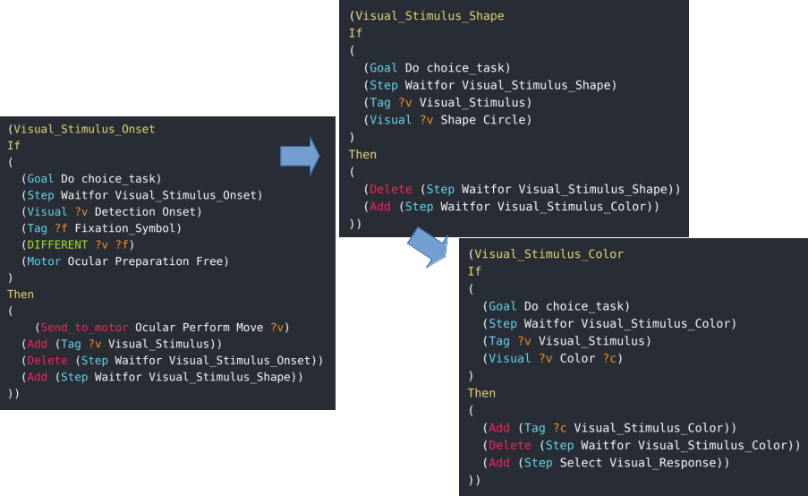

**2. Motor Rule Changes**: Although the stimulus shape in this task is not required for accurate responses, relatively unpracticed participants may use the stimulus shape to distinguish it from the fading working memory trace of the fixation symbol. Thus, here we assume that participants wait to perceive the stimulus shape before considering its color.

**Original Perpetual Rules**

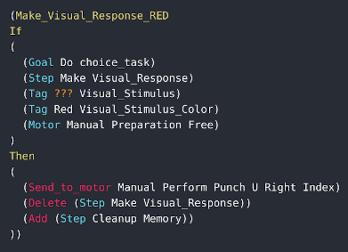

**New Perpetual Rules**

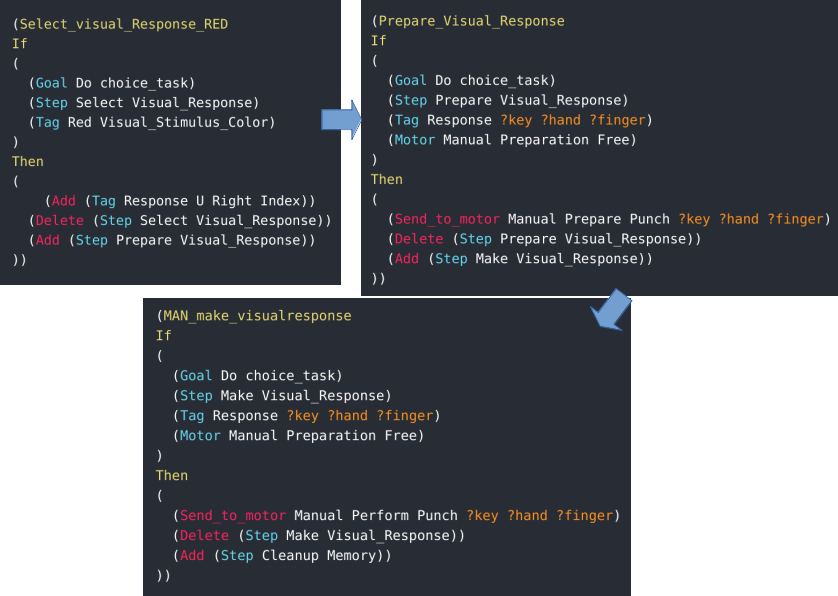

You can edit the currently loaded ruleset in any text editor. Right-clicking on the Normal Output window and selecting "**Edit Production Rule File**" will open the currently selected rules in your system's default editor for .prs text files. Once you are finished editing the ruleset and have saved it to disk (don't forget this step), use **File&#10145;Recompile_Rules**. Alternatively, you could choose **File&#10145;Reload_Last_Session**, which would reload both the device and the ruleset. 

Note that the data for the previous run is still within data_output.csv, so we need to clear out the data file in the **Run_Settings** dialog. Finally, we run the new model to see the modified fit using **Run&#10145;Run**.

The new model's fit between simulated EPIC data and Human data is shown below:

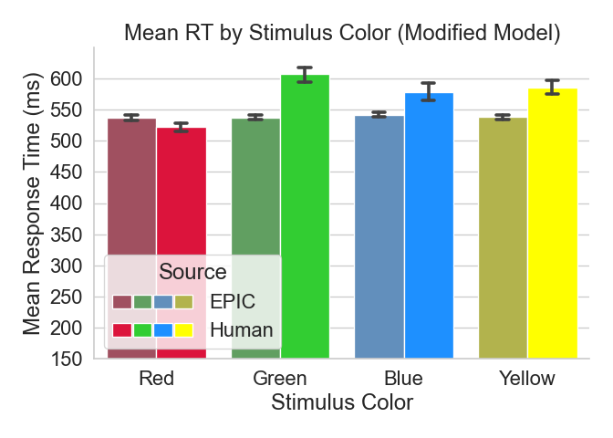

The fit is better, but still not quite right.  

### What's Next?

Clearly, the minimal model is not sufficient, but our modifications are still not capturing the observed human performance. One thing you may have noticed in the task description is that there is a static mapping between the colors Red, Green, Blue, Yellow, and the keys U, I, O, and P. These keys are likewise statically assigned to the fingers Index, Middle, Ring, and Little. This means that there is a confound between color and finger. Although fine for a toy device, a serious psychological experiment would have counterbalanced these associations. In any case, this means that there are two possible explanations for the differences between colors observed in the human data. For example, why is the mean response to Red faster than for other colors? It is possible that humans are faster to perceive red than the other colors. It is also possible that humans are faster to push buttons with their index finger than other fingers. Such assumptions can be added to the model using a visual encoder (e.g., to allow faster perception of Red than other colors) or by altering the rules (e.g., by pre-preparing the Red response at the start of each trial to represent a response-bias).

As this is the documentation for the EPICpy application, not EPIC modeling itself, one will have to look elsewhere to learn how to create/edit rulesets, write encoders, and generally explore the model space for a given task.