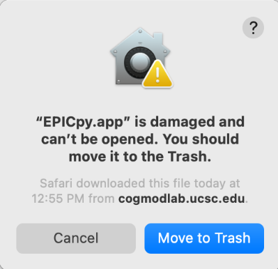

# EPICpy Frequntly Asked Questions

## General

## Linux

## Windows

## MacOS

### - Nothing happens when I double-click on the EPICpy icon

The most likely cause of this is either missing or incomplete XCode installation. You have to first install XCode (described in the [MacOS section of the Installation page](installing.md)). Then you have to run it once -- when you do, it will do a bit of setup and then you can close XCode. You won't need to open it again for EPICpy to work, but EPICpy will use some files contained within XCode.

### - "EPICpy.app" is damaged and cannot be opened

Some users of more recent MacOS versions may receive this message when attempting to start EPICpy:

[](resources/images/macos_problem_error.png)

<mark>**Don't worry, EPICpy.app is not damaged and you should not move it to the trash!**</b>

**Why is this happening?**

Apple makes money from selling apps on its app store, and towards that aim, it thus makes it difficult to run apps not sold there. There is a process to officially anoint (aka "sign") mac apps so that they will not trigger this warning, but it is tedious. This is not a security issue -- anyone can anonymously sign mac apps after a short web search. On the other hand, I am all in favor of extra caution, and (like other operating systems), warning users to be careful when installing apps is a good practice that I agree with. Apple *used* to use more measured language and give you one button to prevent an unsigned application from starting and another button to let the user decide. This made it easy for developers who wanted to distribute applications outside the Apple app store. However, now there is no choice and rather than explaining it, the user is told that the app is broken and should be deleted immediately.

**How can I run EPICpy anyway?**

To tell Macos that you want to choose which software to install, you can disable this filter. You will subsequently be given a choice when installing apps using a slightly different dialog box. To enable this choice, open up the terminal app and enter this command:

```bash
sudo spctl --master-disable
```

Now, when you try to run EPICpy for the first time, you will see this dialog:

[](resources/images/macos_problem_solved.png)

If you press the _**Open**_ button, EPICpy will start, and you will not be bothered in the future when opening this particular app.

Because you will now be given a choice each time to attempt to start a program downloaded from the internet, you could lave things as they are. However, if you would prefer to go back to Apple's default setting of incorrectly labeling unsigned apps "broken" and refusing to run them, you can enter the following command:

```bash
sudo spctl --master-enable
```

