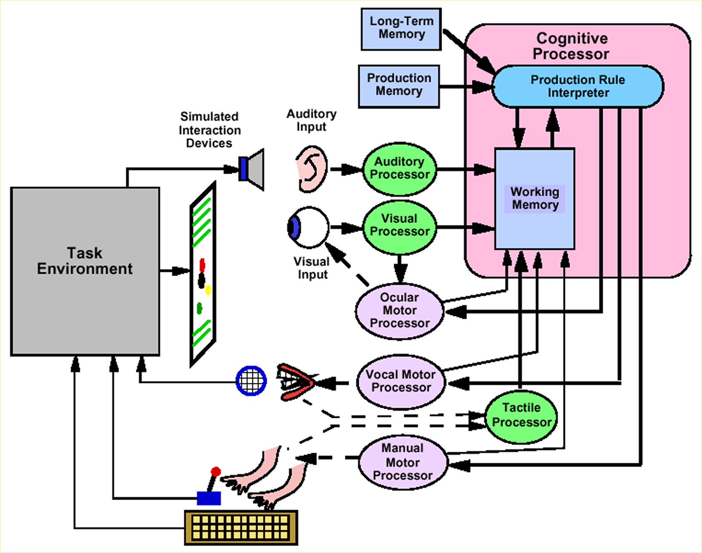

# Welcome to the EPICpy Docs

You can find EPICpy related content at one of these locations:

* [Overview](https://cogmodlab.ucsc.edu/2022/03/14/epic/)
* [Detailed Documentation @ GitHub Pages](https://travisseymour.github.io/EPICpyDocs/) (You're Reading It Now!)
* [EPICpy Article](https://joss.theoj.org/papers/10.21105/joss.04533)
* [Development Environment @ Github](https://github.com/travisseymour/EPICpy)

If you want to jump directly to a step-by-step example of how you use EPICpy to do EPIC modeling (with an admittedly toy-example task), see the [Example](example.md) page. If you are looking for a quick test to make sure EPICpy is working correctly on your computer, go to the [An EPIC Model of the Human Data](example.md#an-epic-model-of-the-human-data) section on the Example page and follow the directions under **Initial Model Process Diagram**.

## What These Docs ARE

This is the documentation for **EPICpy**, a tool for simulating human performance tasks using [EPIC (a computational cognitive architecture created by David Kieras and David Meyer)](epicresources.md). **For a brief overview of EPIC and EPICpy, see the sections below.**

## What These Docs <b>ARE NOT</b>

This documentation is not a detailed introduction to EPIC, device programming, perceptual encoder programming, or production rule programming. To learn more about EPIC and how it works, please see the documents in the [Epic Resources](epicresources.md) section (in particular, the first three). 

## What is EPIC

**EPIC Schematic (Meyer & Kieras 1997a)**

EPIC is a computational cognitive architecture that specifies a theory of human performance and a facility to create individual task models constrained by that theory. EPIC compacts decades of psychological theory and findings into a rich set of processors, including those that model sensory, perceptual, motor, cognitive, and memory subsystems of the human mind. EPIC is particularly suited to stimulus-response type human performance tasks including those involving multitasking and task-switching.

The goal of creating model simulations in EPIC is typically to either verify your understanding of human performance in some task for which you already have human data, or to predict human performance in some speculative task. Either way, this typically involves comparing simulated data from EPIC (e.g., simulated response times, accuracy rates, eye movements, etc.) to human data using a similar task. 

Over many publications (see "Various Published Uses of EPIC" within the [EPIC Resources section](epicresources.md), Kiears, Meyer, and their colleagues have demonstrated that if you 1) create a simulated task within EPIC (called a "device") sufficiently close to the corresponding human task and 2) create a simulated task strategy (embodied within a set of "production rules" and model configurations) sufficiently close to the strategy humans used when performing the task, then EPIC will produce a set of simulated performance data that follows very close (often nearly identical) to the observed human data.

## What is EPICapp 
<b>(the original tool available for EPIC modeling)</b>

The EPIC architecture is a C++ code library (called **_EPIClib_**) capable of simulating human performance according to a particular theory of human performance using a massive set of defaults chosen carefully from various past literatures (with a few guesses where none exists). Although most EPIC modellers only *use* EPICLib, It is possible to alter the EPIC architecture itself to add new processors, change how various components operate, and so on. This requires an advanced level of C++ programming skill (including mastery of various design patterns, and abstraction).

EPICLib module is not generally usable on its own and so David Kieras created EPICapp. EPICapp is a Graphical User Interface (GUI) based application that serves as a controller for EPIC simulations, as well as offering a set of views for visualizing simulation progress. It allows researchers to:

* Create simulated task devices in C++ and load them into the simulation environment.
* Create optional visual and auditory perceptual-encoding models in C++ and load them into the simulation environment.
* Create a file containing If-Then style production rules, that embody a hypothesized task performance strategy, and load it into the simulation environment.
* Set various simulation settings (how many trials to run, how often to update text output information, how often to update graphical output information, which EPIC sub-systems to trace during simulation, device parameters, and rule breakpoints)

Once the simulation has been started and completed, the task device usually saves a representation of the simulated task's data on disk for later analysis. The device also may print rudimentary summary data to text output screen. EPIC includes routines to compute basic descriptive statistics and basic [goodness-of-fit](https://en.wikipedia.org/wiki/Goodness_of_fit) indicators such as correlation, slope, [RMSE](https://en.wikipedia.org/wiki/Root-mean-square_deviation), and R^2. Of course, device programmers are free to write any additional statistics or goodness-of-fit routines they'd like. These routines can sometimes be in service of device logic (e.g., chaining device state if performance falls below some threshold), they are often used for simple post-simulation indications of whether a model is performing according to expectation (e.g., too many errors, or unexpectedly slow). More sophisticated analyses are typically done outside EPICapp using separate statistics software (e.g., [R](https://en.wikipedia.org/wiki/RStudio), [SPSS](https://en.wikipedia.org/wiki/SPSS), [JASP](https://jasp-stats.org/), [SAS](https://en.wikipedia.org/wiki/SAS_(software)), [STATA](https://en.wikipedia.org/wiki/Stata), etc.).

The biggest advantage of using EPICapp to run model simulations is its speed. Because all components (EPICLib, task devices, and perceptual encoders) are written in the highly efficient C++ language and compiled to machine code, EPICapp simulations are extremely fast.

Another advantage is that because programming EPIC, devices, and encoders can occur within a single XCode project, it is easy to write and debug any of these components together using a single debugger context. E.g., one could run a simulation and set breakpoints within either EPIC, the device, or an encoder and then be able to inspect code and data across the entire project.

### EPICapp Challenges That Prompted EPICpy

For those of us who use EPIC in our teaching and research may have encountered four key challenges:

#### 1. C++ Language Expertise is Less Common

There is no doubt that C++ is fast, and its choice for programming EPIC was obvious (in fact, it was a massive improvement on its previous implementation in [Common Lisp](https://en.wikipedia.org/wiki/Common_Lisp)). However, the expertise required to program devices and encoders in C++ is not as common as it used to be. When EPICapp was created, C++ (or perhaps Java, a related skill) was the most common introductory programming language for Computer Science and Cognitive Science majors across the country. Now, this is quite rare, with Python being a significantly more common introductory language. This means that a researcher interested in EPIC modeling will need to acquire sufficient C++ skill to write device and encoder code. This also means that finding graduate students and other assistants with the programming skill to write device and encoder code will be more difficult than it once was.

Although compiled C++ is blazingly fast to run, it is not easy or quick to read or write. Admittedly, simple devices and encoders won't pose too much trouble and may often require only moderate changes to existing example devices or encoders. However, more complex changes may require more serious programming skill. An EPIC modeling facility based on Python instead would lead to slower runtime execution, but much faster development time, trading computational efficiency for programmer efficiency.

#### 2. Development Environment Required

C++ is a compiled language and devices or encoders loaded into EPICapp must be compiled. This means that anyone who wishes to engage in EPIC modeling must set up a full EPIC programming environment so that edited code can be properly compiled. This is not an overly restrictive requirement. For example, setting up the development environment on MacOS isn't that difficult. However, the fact that devices and encoders must be compiled means that they are not particularly portable. Although there is <u><b>only</b></u> currently a MacOS version of EPICapp, if there were versions for other operating systems, devices and encoders would have to be compiled anew for each new OS target. In fact, this could even be a challenge across machines running MacOS if there were sufficiently significant changes to the OS. Soon, different versions will be needed to accommodate those using Apple computers with Intel-based chips and those using the new Apple M-series chips.

If, on the other hand, devices and encoders were programmed with the Python language, the raw uncompiled code (just simple text files) could be loaded directly into the simulation without the need for explicit compilation. Thus, devices and encoders could be freely shared between EPIC modelers regardless of what type of machine they were using.

#### 3. Statistical Abilities Limited

EPIC does not natively contain much in the way of statistical routines. Frequently, after running a model, we compare the simulated output to observed human data. We may also want to compare it to output from other models, or pure mathematical functions. We often find ourselves doing complex data aggregation (e.g., changing 'tall' data arrangements to 'wide' ones) and statistical analyses (e.g., regression, analysis of variance, etc.). Furthermore, statistical analyses are often complemented by graphs and figures tha further clarify the correspondence between simulated EPIC data and observed human data. These analyses and figures are produced by importing data from the model run into a separate statistical analysis tool where custom routines are written. This has worked well, but sharing modeling work with others (students, colleagues, etc.) now means setting up both the EPIC development environment, and a corresponding statistical analysis framework.

An alternative to requiring external statistical analysis tools would be to use the device to create sufficient statistical routines. Thus, the statistical analyses are no more difficult to share than the device itself. This works, but note that many statistical tests are highly non-trivial to write. E.g., writing your own code for a generalized mixed-model repeated-measures anova is extraordinarily difficulty and would require both advanced programming ability and significant statistical prowess. It is not clear how one would producing graphs and figures directly from the device code without significant edits to the EPICapp GUI code itself (possible, but non-trivial).

If, devices were programmed in Python, modelers could easily take advantages of a rich set of easy to use free external modules and packages that allow statistical analyses ranging from the very simple to the very complex (e.g., scipy.stats and statsmodels. Furthermore, a similarly impressive set of powerful graphing facilities would be available. Most of these modules (many based on the popular [Matplotlib](https://matplotlib.org/) library, e.g., [Seaborn](https://seaborn.pydata.org/)) would allow the display of graphs.

#### 4. Lack of Cross-Platform Versions of EPICapp

Although EPIC itself could be adapted by a skilled programmer to compile bespoke versions for other operating systems, a fully working and runnable EPIC-only code base has yet to be made public.

However, EPICapp, the tool one uses to actually manage and run EPIC simulations is only available for MacOS. Not only is the EPICapp GUI written in mac-specific [Objective-C](https://en.wikipedia.org/wiki/Objective-C) targeting Apple's own windowing facilities, but the development project setup and configuration are not publicly specified. Thus, in order to convert the EPICapp development environment to another operating system, one would have to completely deconstruct the development environment requirements, and then re-write the entire GUI and simulation logic in a new (hopefully cross-platform) GUI framework.

This conversion could, of course, be done, but it is not trivial. Because this has yet to be done, currently the only available version of EPICapp is for MacOS.

### How EPICpy Addresses EPICapp Challenges

The previous section lays out 4 main challenges that potential EPIC modelers face:

1. Reliance on the C++ programming language limits programmer pool.
2. Reliance on compiled code requires both development environment setup and limits device and encoder sharing between platforms.
3. Statistical facilities limited, no graphing available.
4. Only runs on system running MacOS.

<u>EPICpy was created to address these issues.</u>

#### EPICpy uses Python rather than C++

First, it should be pointed out that EPICpy is not **completely** written in Python. EPICLib itself, that is, the cognitive architecture and various routines to allow creation and management of simulations using EPIC's subsystems, is still written in C++ and compiled into an importable module for Python on Macos, Linux, and Windows.

Everything else is programmed in Python. This includes task devices and perceptual encoders, which are programmed in Python and are stored and loaded into EPICpy as raw Python code. This means that no compilation is required; An EPICpy device written on one operating system will work exactly the same on another operating system. Most EPIC modeling is some combination of work on devices, encoders, and rule files. In EPICpy, these are all just text files.

#### EPICpy requires no device/encoder compilation 

Because EPICpy devices and encoders are now just text-based Python code files, it means that the majority of EPIC modeling work can now be done with a code/text editor, no C++ or Python development environment is required. Just update your device in a text editor, have EPICpy re-load it, and press run to see your changes (or error messages, if something goes awry). In a sense, EPICpy itself becomes your development environment. Because Python code is relatively easy to read and write, it will be much easier to find students, assistants and collaborators who have sufficient skill to create or edit devices and encoders.

#### EPICpy GUI written in Python

The EPICpy GUI application itself is written in Python. This means that if one desires to actually alter the operation of the EPICpy interface, they are free to do so. However, this would require setting up the EPICpy development environment on your computer. Running such an updated version of EPICpy would be easy, but compiling your changes back into a cross-platform executable will take further steps and knowledge. If you want to do this, see the appropriate "**EPICpy Development Environment**" section on the [Installing EPICpy](installing.md) page.

#### EPICpy allows use of Python statistical and graphing

Python has a rich set of modules and packages for statistical analysis and graphing. Because EPICpy includes the [Pingouin Statistical Package](https://pingouin-stats.org/), device programmers have access to the following facilities (see Pingouin docs for other imported packages):

* [pingouin](https://pingouin-stats.org/)
* [statsmodels](https://www.statsmodels.org/)
* [pandas](https://pandas.pydata.org/)
* [pandas-flavor](https://github.com/Zsailer/pandas_flavor)
* [numpy](https://numpy.org/)
* [scipy](https://www.scipy.org/)
* [matplotlib](https://matplotlib.org/)
* [seaborn](https://seaborn.pydata.org/)

Access to these packages in device code is enabled through standard Python import statements. Display of statistical analyses and graphs is enabled by using the `stats_write()` method which can accept text, pandas dataframes and other objects, as well as figures and other matplotlib-based objects.

Although we don't recommend programming full data analyses at the end of each simulation run, this statistical facility will allow most conceivable post-run analyses a modeler might need.

#### EPICpy is Cross Platform

EPICpy was developed by Travis L. Seymour, PhD on the [Ubuntu](https://ubuntu.com/) Linux operating system (as well as variants such as [Linux Mint](https://linuxmint.com/) and [Pop!_OS](https://pop.system76.com/)). To facilitate the installation and use of EPICpy across platforms, we are using the PipX system for automatically running Python applications in isolated environments. After users install PipX itself, it's a single command across operating systems to install EPICpy. However, because EPICLib itself is compiled, there are some limitations: On Linux and Macos, Python 3.10.?? must be installed, and on Windows 10 and 11, Python 3.9.?? must be installed. Once PipX and the needed version of Python are installed, EPICpy should install and run on either of these three operating systems. For detailed installation instructions, please see the corresponding section on the [Installing EPICpy](installing.md) page.

Thus, EPICpy can be used on Linux, MacOS (Intel and Apple CPUs), and Windows based computers.

#### Other New Features in EPICpy

(in no particular order)
* Dark/Light Mode Toggle
* Background Images For View Windows (not useful for modeling, but great for talks and demonstrations)
* Text and Stats Output Window Content Exporting (as text, html, markdown and odf)
* Device load triggers automatic load of last ruleset used with that device
* One-Button Reinstatement of Previous Modeling Session (i.e., device, rules, encoders)
* Automatically Remembers and Reinstates Dimensions of all Dialog Windows.
* Automatically Reinstates GUI Settings and Parameters For Each Device (including all window positions and sizes)
* Ability to Load and Run Multiple Rulesets Sequentially
* Ability to Add Parameters to the Device Condition String to enable parametric model runs (e.g., `10 [Easy|Hard]` would run 10 trials of the Easy condition and then 10 trial of the Hard condition.)
* Adjustable Application Font Size
* Adjustable Detail for Sound and Speech Object Display (e.g., determine which attributes of the `Speech_word` class to show on the perceptual output window)
* <strike>Selectable EPIC Architecture Versions (currently models can be run under the 11/28/2014 release of EPIC or the 6/28/2016 release.)</strike> EPICLib is now fixed to the 2016 release.
* Access to Some Device Configuration from the GUI (e.g., device programmer might expose toggle for showing debug information, or altering device operation)
* Added Window-Management Facilities (e.g., Double-clicking output window brings all windows to front, Minimize all windows, Show all windows, Restore Default Layout)
* It is Now Possible to **UN**load perceptual encoders. Unloaded encoders will not be re-loaded during subsequent session reloads.

---

Jan 23 2025 10:20am