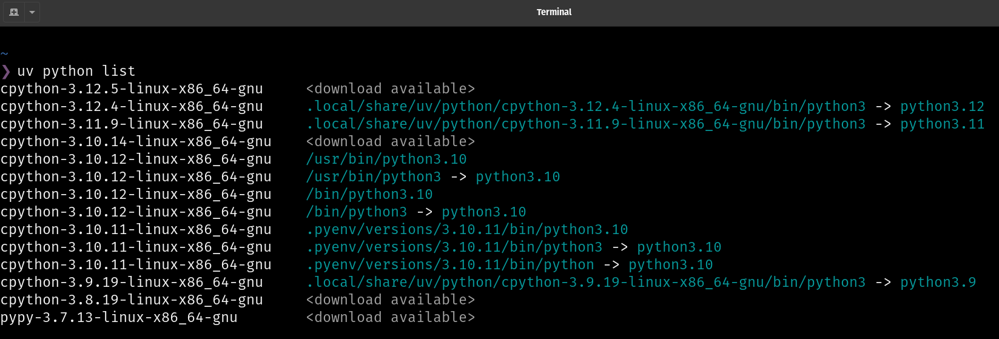
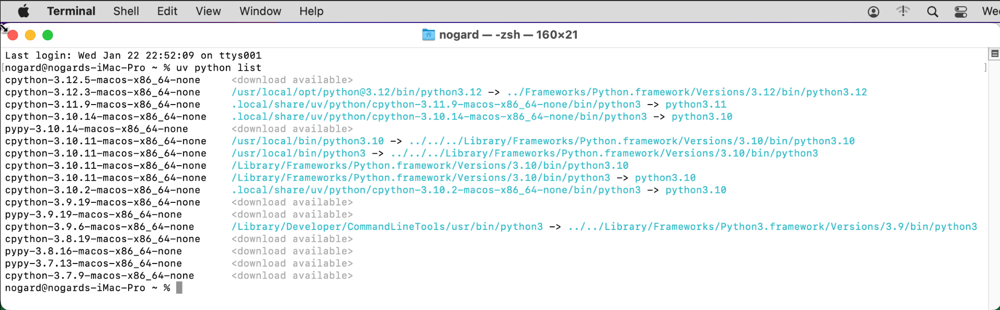
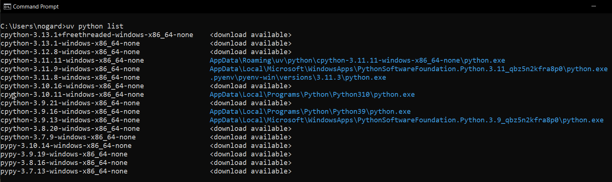

# Installing EPICpy

## Tested Platforms

Installation of EPICpy has only been successfully tested on the platforms listed below:

Linux Variants:

- [x] Debian-based Linux variants (e.g., Ubuntu, Mint, PopOS, etc.)
- [ ] Redhat-based Linux variants (e.g., Redhat, Fedora, Centos, etc.)
- [ ] Arch-based Linux variants (e.g., ArchLinux, Manjaro, EndeavourOS, etc.)

Linux Versions:

- [x] 18.04 "Bionic"
- [x] 20.04 LTS "Focal"
- [x] 22.04 LTS "Jammy"
- [x] 24.04 LTS "Jellyfish"

MacOS Versions:

- [x] 10.15 "Catalina" (Intel CPU)
- [x] 11 "Big Sur" (Intel CPU)
- [x] 12 "Monteray" (Intel CPU)
- [x] 12 "Monteray" (Apple CPU)
- [x] 13 "Sonoma" (Apple CPU)

Windows Versions:

- [x] 10
- [ ] 11

If your goal is to use EPICpy to a) run EPIC simulations, b) create or edit device files, c) create and edit perceptual encoder files, or c) create or run rule files, then there is no need to set up and configure the entire EPICpy development environment. All you need to do is install EPICpy using [uv](https://docs.astral.sh/uv/) or [PipX](https://pipx.pypa.io/latest/installation/) and then download the demo task-device package.


## Installation Overview

Installing EPICpy requires 5 steps:

1. If needed, install some prerequisites
2. Install a python tool manager such as [uv](https://docs.astral.sh/uv/).
3. Verifying you have a suitable version of python installed.
4. If needed, use [uv](https://docs.astral.sh/uv/) or some other approach to install a suitable version of Python.
5. Install EPICpy

NOTE: It is possible to use [PipX](https://pipx.pypa.io/latest/installation/) instead of [uv](https://docs.astral.sh/uv/). Although the instructions below focus on [uv](https://docs.astral.sh/uv/), feel free to use any alternative you prefer. I prefer [uv](https://docs.astral.sh/uv/) because it can both manage Python versions and Python tool installations. It also has the advantage of being easier to install than [PipX](https://pipx.pypa.io/latest/installation/). Similarly, when it comes to installing Python, there are several alternative approaches. I recommend the [uv](https://docs.astral.sh/uv/) based workflow below.

## 1. Install Prerequisites?

To do the steps below, you will need the `cUrl` and `git` utilities installed on your computer.

### Linux

- **cUrl**: Linux typically has `curl` installed. You can check this by running `curl --version` in a terminal. If it complains, you can install `curl` using your package manager, e.g. `sudo apt install curl`
- **git**: Linux often has `git` installed. You can check this by running `git --version` in a terminal. If it complains, you can install `git` using your package manager, e.g. `sudo apt install git`

### MacOS

- **cUrl**: Linux typically has `curl` installed. You can check this by running `curl --version` in a terminal. If it complains, you can install `curl` using your package manager, e.g. `sudo apt install curl`
- **git**: MacOS does not ship with `git`, and unfortunately, it's not simple to install it. Here are some options:
  - Install `XCode` from the Apple Store. It's large and will take some time to download and install. Once installed, open `XCode` and accept the license agreement. If it asks you to install the commandline-tools, say yes (that's when `git` is installed). Once `XCode` is installed, and you have accepted the license agreement, then `git --version` should work. If so, you now have `git`.
  - Install `homebrew` from this [website](https://brew.sh/), which will ask you to run this script in a terminal:
  

```bash
  /bin/bash -c "$(curl -fsSL https://raw.githubusercontent.com/Homebrew/install/HEAD/install.sh)"
```
- Once `homebrew` has finished installing, you can type this command in a terminal:


```bash
brew install git
```


  - There are other options on the `git` [website](https://git-scm.com/downloads/mac)


### Windows 10 (and _probably_ Windows 11)

- **cUrl**: Windows 10 typically has `curl` installed. You can check this by running `curl --version` in a terminal. 
- **git**: Windows does not ship with `git`, but you can install it by going to the `git` [website](https://git-scm.com/downloads/win), downloading the appropriate binary installer, and running it. To verify the installation, go to the terminal and type `git --version`.

## 2. Install the `uv` Python Tool Manager

The official instructions for installing `uv` can be found on their [installation page](https://docs.astral.sh/uv/getting-started/installation/). The critical steps are duplicated here:

### MacOS and Linux

In a terminal, use `curl` to download the script and execute it with `sh`:

```bash
curl -LsSf https://astral.sh/uv/install.sh | sh
```

### Windows

In powershell or cmd, use `irm` to download the script and execute it with `iex`:

```bash
powershell -ExecutionPolicy ByPass -c "irm https://astral.sh/uv/install.ps1 | iex"
```


## 3. Use `uv` To Check Your Python Installations

In a terminal, enter this command:

```bash
uv python list
```

On my system (Pop_OS Linux 20.04), I get a list like this:

[](resources/images/python_list_linux.png)

As you can see, I have several versions of Python installed. The current version of EPICpy requires specific versions to be installed:

- **Windows**: Python 3.9 
- **MacOS & Linux**: Python 3.10

As you can see above, I have multiple listings for Python 3.10. It would be wise to take the latest one. In the above image, I would make note of the path `/usr/bin/python3.10`, but either of the paths with 3.10 would be fine.

Note that on MacOS, the listing would be similar. As with Linux, you're looking for an installed version of Python 3.10.

[](resources/images/python_list_macos.png)

On Windows, you might get a listing like this:

[](resources/images/python_list_windows.png)

Because we'd be looking for Python 3.9, I might make note of this path: `AppData\Local\Programs\Python\Python39\python.exe`

## 4. Use `uv` To Install A Suitable Python Version (if you didn't find on earlier)

If you found a path to Python 3.10 (Linux & MacOS) or 3.9 (Windows), then you already have a version of Python that will work with EPICpy. If not, you can use `uv` to install a suitable version of Python:

#### MacOS and Linux

Install Python 3.10

```bash
uv python install 3.10
```

View and make a note of the file path

```bash
uv python list
```

#### Windows

Install Python 3.9

```bash
uv python install 3.9
```

View and make a note of the file path

```bash
uv python list
```

## 5. Use `uv` To Install EPICpy

Now that we have `uv` and a suitable version of Python installed, we can install EPICpy. The general format would be something like this:

```bash
uv tool install git+https:github.com/travisseymour/EPICpy.git --python [PATH_TO_PYTHON]
```

E.g. (your your command will depend on which python path you use):

#### Linux (has to be Python 3.10)

```bash
uv tool install git+https:github.com/travisseymour/EPICpy.git --python /usr/bin/python3.10
```

#### MacOS (has to be Python 3.10)

```bash
uv tool install git+https:github.com/travisseymour/EPICpy.git --python @@@@@@@@@
```

#### Windows (has to be Python 3.9)

```bash
uv tool install git+https:github.com/travisseymour/EPICpy.git --python AppData\Local\Programs\Python\Python39\python.exe
```


<hr/>

## Check your EPICpy install

To run EPICpy, just open a terminal and type `EPICpy`, this should open several windows associated with the EPICpy 
application. In the menu, navigate to **Help->Tests->Standard_Run**. This should cause a test run of the demo 
choice-task device. If it completes and shows a colorful results graph, then all is well. Note that some users report having to run **Help->Tests->Standard_Run** a second time in order for the test to run successfully.

## What if you Want To Upgrade To The Latest Version of EPICpy?

On all operating systems, just open a terminal and type:

Is EPICpy installed [OPTIONAL]?

```bash
uv tool list
```

**Upgrade EPICpy**

```bash
uv tool upgrade EPICpy
```

## What if You Want To Uninstall EPICpy?

On all operating systems, just open a terminal and type:

Is EPICpy installed [OPTIONAL]?

```bash
uv tool list
```

**Uninstall EPICpy**

```bash
uv tool uninstall EPICpy
```