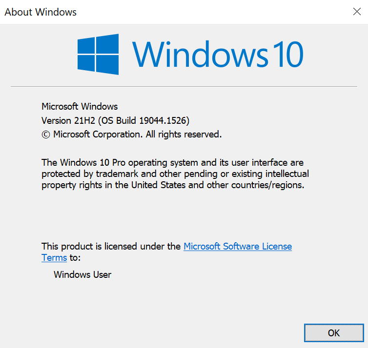
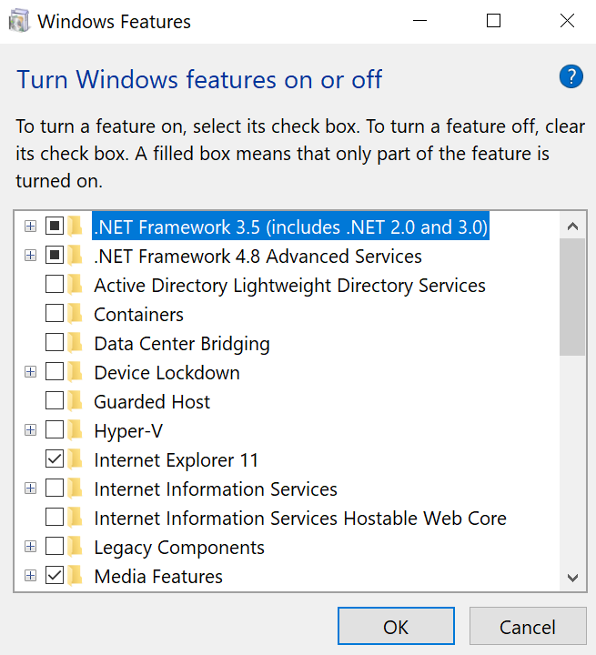
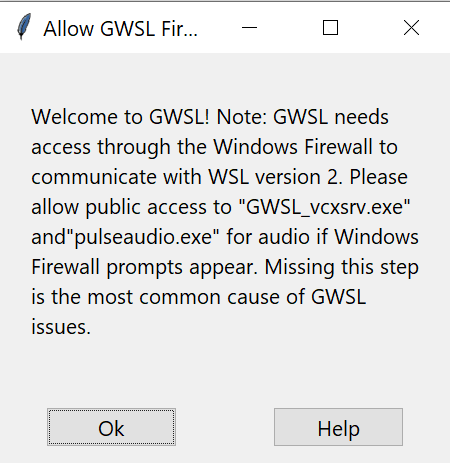
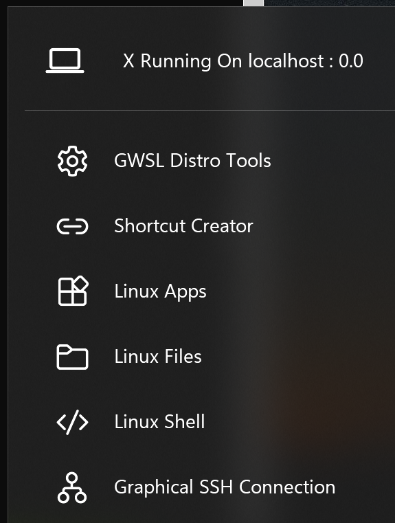
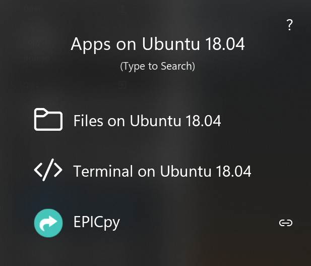

# Running EPICpy under WSL2 on Microsoft Windows

To use the instructions below you will need Windows 10 Version 21H2 or later, or Windows 11. The goal of these instructions is to setup the Windows Subsystem For Linux (version 2), aka WSL2, install the Ubuntu Linux distribution, and then to install and run the Linux version of EPICpy.

Given that there is no Windows version of EPICpy, this is the best way to run EPICpy on Windows.

## Verify Your Windows 10 Version

To see if you have the minimum version of Windows 10 to use these instructions, bring up the Windows menu (click the little windows icon in the bottom left of the screen). When the menu shows up, just start tying the word `winver`, which will point to the WinVersion utility. Press Enter to launch it. You will see a window like this:

[](resources/images/winver_output.png)

If the version is 21H2 or later, these instructions will work for sure. If not, you may have to do some extra work to install WSL2 (as opposed to WSL1). They may work, but they are untested on versions earlier than 21H2.

If you are running Windows 11, this is not an issue as you are already setup to run WSL2 GUI-based Linux applications.

## Enable Windows Subsystem for Linux
To enable WSL2, bring up the Windows menu (click the little windows icon in the bottom left of the screen). When the menu shows up, just start tying the word `features`, which will show a list of choice including one that reads `Turn Windows features on or off`. Choose this option (highlight and ENTER, or mouse click) to launch it. You will see a window like this:

[](resources/images/windows_features.png)

Make sure these options are **Checked (Enabled)**:

1. Virtual Machine Platform
2. Windows Hypervisor Platform
3. Windows Subsystem for Linux
4. Windows PowerShell X.X (Optional...probably already checked)

Press OK to enable these options, it will take a moment to work. Eventually you will see the message "Windows completed the required changes." and will be presented with a button to [**RESTART NOW**]. Press this button to restart Windows.

## Installing Ubuntu Linux Under WSL2

### Install Ubuntu

Now that WSL2 is installed, you need a version of Linux. Go to the Windows Store and type `Ubuntu` in the search bar. Windows will offer a few versions of Ubuntu that will work with WSL2. The oldest version of Ubuntu compatible with EPICpy is Ubuntu 18.04 LTS, but Ubuntu 20.04 LTS (or newer) should also work.

Select a version of Ubuntu and press the **[Get]** button (Ubuntu is free, there will be no charge). When installation is finished, the **[Get]** button turns to **[Open]**. Press the Open button and wait while Ubuntu gets setup (takes a few minutes).

You will be prompted for a new Linux username (doesn't have to be your Windows username), and a Linux passowrd (doesn't have to be your Windows password...I suggest you choose a new one).

You will be deposited in the linux commandline and can now begin installing EPICpy.

### Update Software Repository

at the Ubuntu command prompt, type the following

```bash
sudo apt update
```

## Install EPICpy

For instructions on installing EPIC under Ubuntu, see the **Linux** section of the [Installing EPICpy](installing.md) page.

Note that the very last command used to run EPICpy (`/opt/EPICpy/EPICpy`) will NOT work yet for Ubuntu under WSL. We will fix that in the next section

## Installing an XServer for WSL2

At this point you have Ubuntu installed in a virtual machine managed by WLS2. EPICpy is a graphical application with a Graphical User Interface (GUI). You want to run EPICpy on the virtual machine, but view the GUI on your actual Windows desktop. To do this, we need a tool that will interpret graphical commands from the Ubuntu and realize them in your Windows desktop. We will use something called an X-Windows Server (or XServer for short). There are many XServers available for Windows, but we will use one called GWSL.

Open the Windows Store and search for `GWSL`. Then **[GET]** this application. When if finishes installing, press the **[OPEN]** button to launch it.

Note that the first time GWSL launches, you will recieve this firewall notice:

[](resources/images/gwsl_firewall_notice.png)

This is perfectly normal...XServers work by creating a virtual network over which Ubuntu and your actual Windows desktop can communicate. Clicking the [OK] button is giving GWSL permission to set up this communication so that any graphical (via `GSWL_vcxsrv.exe`) or auditory (via `pulseadio.exe`) generated on Ubuntu will be transfered to your desktop. This is how GWSL creates the illusion that graphical apps running on Ubuntu are running on your Windows desktop.

Windows will verify this twice, once for `GSWL_vcxsrv.exe` and once for `pulseadio.exe`. You will need to press the [ALLOW ACCESS] button for each in order for GWSL to work properly.

## Running EPICpy with GWSL

Once GWSL is installed, you will notice a new icon in your Windows icon bar for GWSL, and if you click on this icon, you will see a menu like this:

[](resources/images/gwsl_menu_1.png)

If you click the **[Linux Apps]** link, you will see this sub-menu:

[](resources/images/gwsl_menu_2.png)

Here you can do 3 neat things:

1. Open a terminal window in case you want to enter commands at the Ubuntu command prompt
2. Use the Windows File Explorer to mangage files on your Ubuntu virtual machine. This can be handy for moving EPIC simulations and data between your Windows desktop and your EPICpy work folder in your Ubuntu account. Note, this will show you the rool Linux folder. It's dangerous to mess around with these files. Your home folder (i.e., the place you start when you launch the Ubuntu command prompt) lives in the `home` folder. In side `home`, you will see a home folder with the name you choose for your Ubuntu account name. Inside the command prompt, this can be found using the address `/home/YOUR_UBUNTU_USER_NAME`. In the Windows File Explorer, this address will be `\\wsl$\Ubuntu-18.04\home\YOUR_UBUNTU_USER_NAME`
3. A list of installed Linux GUI applications. So far, the only one you should see is EPICpy. Click it to launch EPICpy. 

## Your First EPIC Simulation

At this point, run EPICpy, load one of the devices, compile the corresponding ruleset, and then run the simulation. For example:

1. **File->Load_Device** the Choice Device (`devices/choice/choice_device.py`).
2. **file->Compile_Rules** the visual-manual choice ruleset (`devices/choice/rules/choicetask_rules_VM.prs`).
3. For a quick test, go into **Run->Settings** and set the parameter string to `10 4 Hard Draft` (should be the default). For a complete set of choice-task data (produces a nice 2-factor graph), set the parameter string to `10 4 [Easy|Hard] [P1|P2|P3|P4]`
4. Now choose **Run->Run**.

**--OR--**

For a quick run of 10 choice-task trials with a visual encoder attached and 10 choice-task trials without an encoder attached, choose **Test->Run Tests->All Runs**


