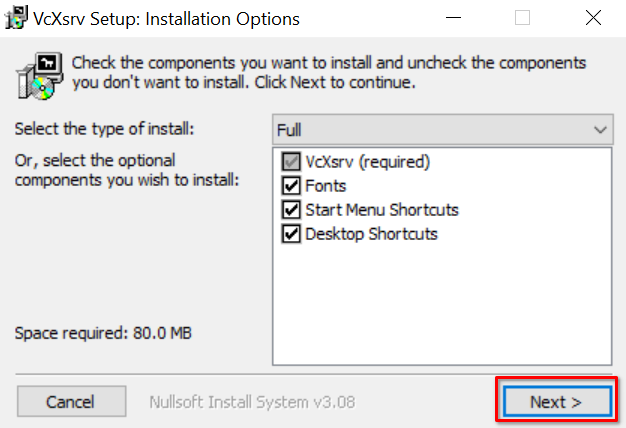
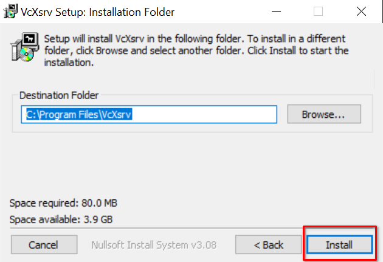
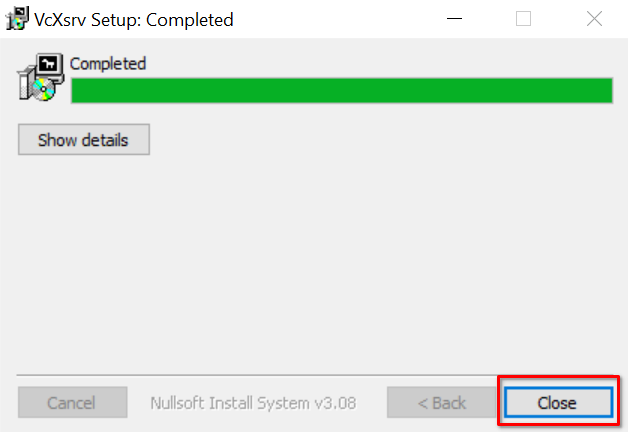
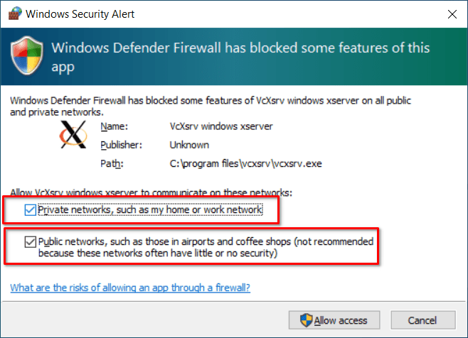
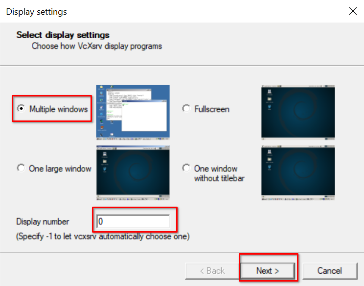
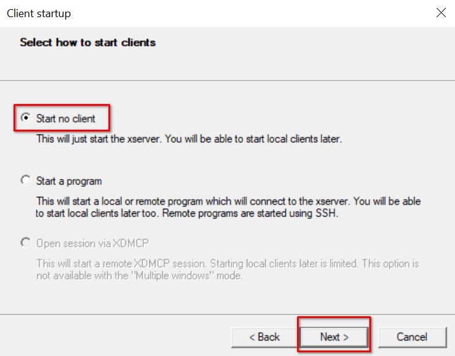
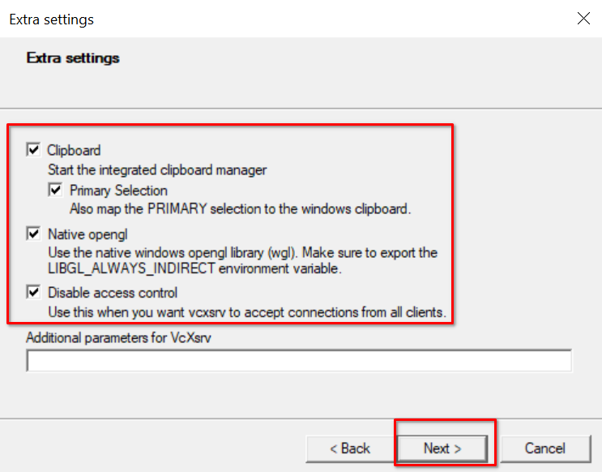
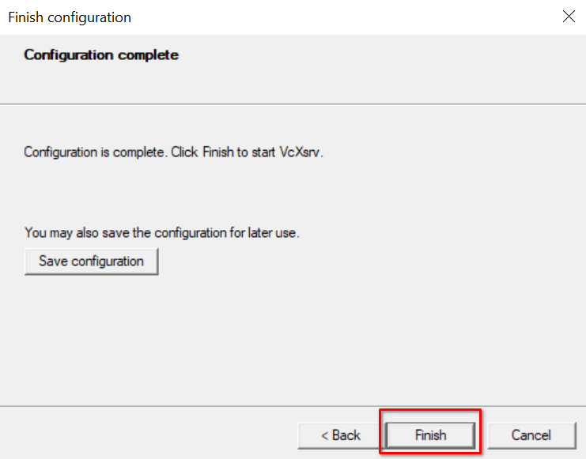

# Running EPICpy under WSL2 on Microsoft Windows

To use the instructions below you will need Windows 10 Version 21H2 or later, or Windows 11. The goal of these instructions is to setup the Windows Subsystem For Linux (version 2), aka WSL2, install the Ubuntu Linux distribution, and then to install and run the Linux version of EPICpy.

Given that there is no Windows version of EPICpy, this is the best way to run EPICpy on Windows.

## Verify Your Windows 10 Version

To see if you have the minimum version of Windows 10 to use these instructions, bring up the Windows menu (click the little windows icon in the bottom left of the screen). When the menu shows up, just start tying the word `winver`, which will point to the WinVersion utility. Press Enter to launch it. You will see a window like this:

[](resources/images/winver_output.png)

If the version is 21H2 or later, these instructions will work for sure. If not, you may have to do some extra work to install WSL2 (as opposed to WSL1). They may work, but they are untested on versions earlier than 21H2.

If you are running Windows 11, this is not an issue as you are already setup to run WSL2 GUI-based Linux applications.

## Enable Windows Subsystem for Linux
To enable WSL2, bring up the Windows menu (click the little windows icon in the bottom left of the screen). When the menu shows up, just start tying the word `features`, which will show a list of choice including one that reads `Turn Windows features on or off`. Choose this option (highlight and ENTER, or mouse click) to launch it. You will see a window like this:

[](resources/images/windows_features.png)

Make sure these options are **Checked (Enabled)**:

1. Virtual Machine Platform
2. Windows Hypervisor Platform
3. Windows Subsystem for Linux
4. Windows PowerShell X.X (Optional...probably already checked)

Press OK to enable these options, it will take a moment to work. Eventually you will see the message "Windows completed the required changes." and will be presented with a button to [**RESTART NOW**]. Press this button to restart Windows.

## Installing Ubuntu Linux Under WSL2

### Install Ubuntu

Now that WSL2 is installed, you need a version of Linux. Go to the Windows Store and type `Ubuntu` in the search bar. Windows will offer a few versions of Ubuntu that will work with WSL2. The oldest version of Ubuntu compatible with EPICpy is Ubuntu 18.04 LTS, but Ubuntu 20.04 LTS (or newer) should also work.

Select a version of Ubuntu and press the **[Get]** button (Ubuntu is free, there will be no charge). When installation is finished, the **[Get]** button turns to **[Open]**. Press the Open button and wait while Ubuntu gets setup (takes a few minutes).

You will be prompted for a new Linux username (doesn't have to be your Windows username), and a Linux passowrd (doesn't have to be your Windows password...I suggest you choose a new one).

You will be deposited in the linux commandline and can now begin installing EPICpy.

### Update Software Repository

at the Ubuntu command prompt, type the following

```bash
sudo apt update
```

## Install EPICpy

For instructions on installing EPIC under Ubuntu, see the **Linux** section of the [Installing EPICpy](installing.md) page.

Note that the very last command used to run EPICpy (`/opt/EPICpy/EPICpy`) will NOT work yet for Ubuntu under WSL. We will fix that in the next section

## Installing an XServer for WSL2

At this point you have Ubuntu installed in a virtual machine managed by WLS2. EPICpy is a graphical application with a Graphical User Interface (GUI). You want to run EPICpy on the virtual machine, but view the GUI on your actual Windows desktop. To do this, we need a tool that will interpret graphical commands from the Ubuntu and realize them in your Windows desktop. We will use something called an X-Windows Server (or XServer for short). Let's use one called **VC X-Server**.

Download and install the installer from the VcXsrv Project web page: [https://sourceforge.net/projects/vcxsrv/](https://sourceforge.net/projects/vcxsrv/). The last time I downloaded this file it was called _vcxsrv-64.1.20.14.0.installer.exe, but it may have been updated since then and have a slightly different version in the name. Double-click to install this file. 

When installation starts, you should see a screen like this:

[](resources/images/vcxsrvpics/install1.png)

Leave all options selected and press **[NEXT]**. Afterwards, you'll see this window:

[](resources/images/vcxsrvpics/install2.png)

Assuming this is where you want to save the VcXsrv application, click **[INSTALL]**. When this finishes, you will see a window like this:

[](resources/images/vcxsrvpics/install3.png)

Press **[CLOSE]** to complete this process.

Note that the first time you run VcXsrv, you will see a Windows Firewall notice like this:

[](resources/images/vcxsrvpics/vcxsrvfirewall.png)

Make sure you press the **[Allow access]** button. Note that this is necessary because you are running EPICpy in a virtual Linux machine and showing the graphics on your Windows machine. Even though these 2 exist on the same physical computer, they are part of a virtual server/client relationship and as far as these two applications are concerned, they are speaking separately across a network. Allowing this communication through the Windows Firewall allows EPICpy to work as intended.


## Running EPICpy with VcXsrv

Once VcXsrv is installed, you will notice a new icon on your Windows icon bar (or maybe it's on your Desktop). It will look something like this:

[](resources/images/vcxsrvpics/icon.png)

**NOTE: that the following steps will have to be repeated during every session during which you run the EPICpy application (i.e., between reboots)**

First, double-click on the XLaunch icon, you will see a screen like this:

[](resources/images/vcxsrvpics/dialog1.png)

Choose "Multiple Windows". Then choose a Display Number of 0. Press **[NEXT]** to see the next window:

[](resources/images/vcxsrvpics/dialog2.png)

Choose "Start no client" and Press **[NEXT]** to see the next window:

[](resources/images/vcxsrvpics/dialog3.png)

On this screen <u>check ALL of the checkboxes</u>! The "Disable access control" option may not be checked by default, but EPICpy will not be able to connect to VcXsrv without this option checked. Afterwards press **[NEXT]** to see the final screen:

[](resources/images/vcxsrvpics/dialog4.png)

Notice that this screen has an option to save the configuration to remember your changes each time you go through these dialogs. However, this may not work. If not, then just enter the above settings each time.

Press **[FINISH]** to complete this process.

Next you need to start Ubuntu (it's ok if it is already open). On the commandline, type in (or better yet, do a copy/paste) this exact command. Note that the odd locking backticks are on purpose:

```bash
export DISPLAY="`grep nameserver /etc/resolv.conf | sed 's/nameserver //'`:0"
```

Then, assuming you have installed EPICpy in the default location, you can start EPIC with this command:

```bash
/opt/EPICpy/EPICpy
```

If this works, you should see the EPICpy GUI.

## Your First EPIC Simulation

At this point, run EPICpy, load one of the devices, compile the corresponding ruleset, and then run the simulation. For example:

1. **File->Load_Device** the Choice Device (`devices/choice/choice_device.py`).
2. **file->Compile_Rules** the visual-manual choice ruleset (`devices/choice/rules/choicetask_rules_VM.prs`).
3. For a quick test, go into **Run->Settings** and set the parameter string to `10 4 Hard Draft` (should be the default). For a complete set of choice-task data (produces a nice 2-factor graph), set the parameter string to `10 4 [Easy|Hard] [P1|P2|P3|P4]`
4. Now choose **Run->Run**.

**--OR--**

For a quick run of 10 choice-task trials with a visual encoder attached and 10 choice-task trials without an encoder attached, choose **Test->Run Tests->All Runs**


