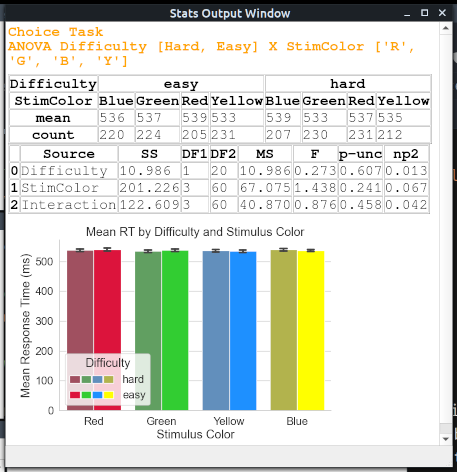
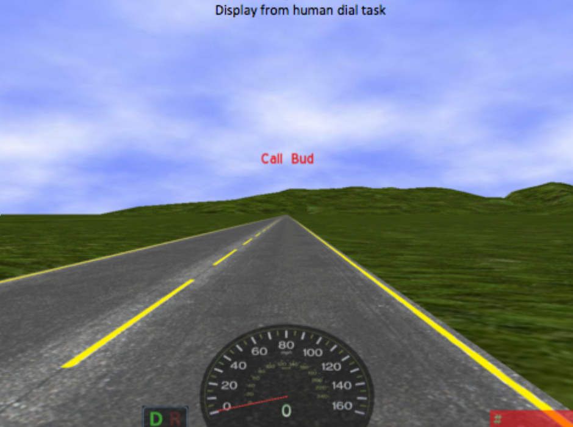
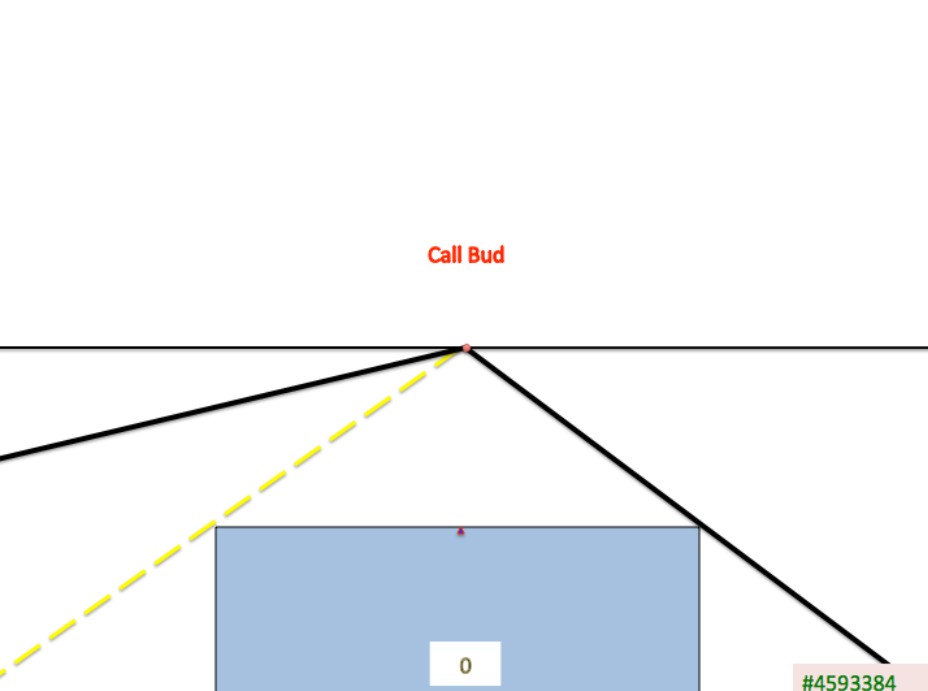
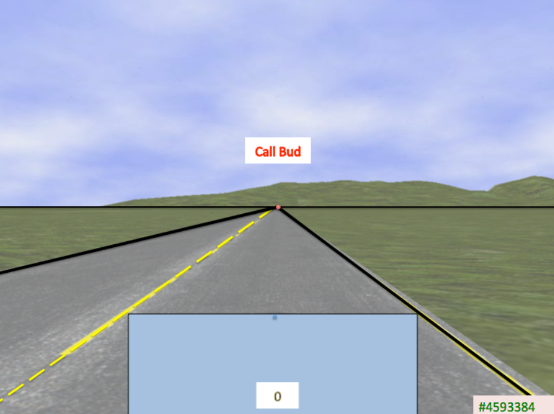
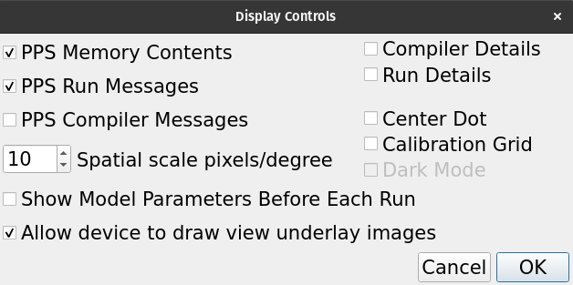
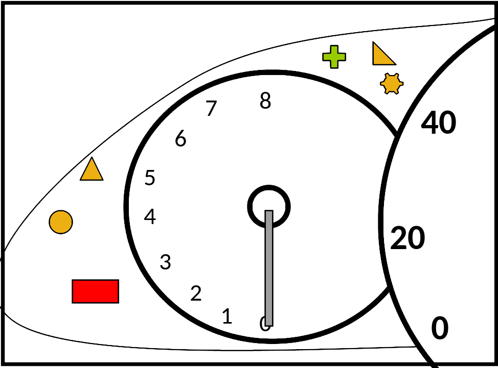

# EPICpy Model Programming

A detailed introduction to EPIC modeling is beyond this documentation, however, my book **__An EPIC Introduction to Computational Cognitive Modeling__** will be available soon! Below are just a few notes specific to these facilities in EPICpy specifically. For now, the best way to learn how devices, encoders, and rule-files work is to read the corresponding demo files carefully.

## Devices

As discussed in the Introduction and the Simulation Components sections, a device is a virtual task with which the simulated human interacts. Devices typically (though not necessarily) derive from real-world tasks previously used with humans (or are candidate tasks that might later be used with humans). In any case, a device is a mini program that describes a task environment. The key difference between an EPIC device and a human task is that the device must specify the intersections between the virtual task and the virtual human. For example, rather than just placing a visual stimulus on the virtual display, the device must specify which perceptual information about visual stimuli will be transmitted to and potentially available to the virtual human. Critically, these properties may be a subset of the properties available to humans doing a related task. For example, this is the device code necessary to play a warning beep sound while presenting a '#' symbol on the display just north-east of the screen center:

```python
# Show fixation stimulus
self.make_visual_object_appear(self.wstim_v_name, GU.Point(0., 0.), GU.Size(1., 1.))
self.set_visual_object_property(self.wstim_v_name, Text_c, Symbol("#"))
self.set_visual_object_property(self.wstim_v_name, Color_c, Black_c)

# Play fixation beep
wstim_snd_name = concatenate_to_Symbol("WarningSound", self.trial)
self.make_auditory_sound_event(wstim_snd_name, Symbol("Signal"), GU.Point(0, -5), Symbol("Beep"), 12, 300)
```

These commands both cause a change in the task (draw something on the virtual display, play a sound via the virtual speakers), but they also signal the initiation of sensory onsets in the virtual performer.

The device operation is event driven and is designed to fit within the [discrete-event simulation](https://en.wikipedia.org/wiki/Discrete-event_simulation) framework EPIC employs. THe device starts by waiting for a START signal from the simulation controller and defines what behavior to take when this occurs, including what the next state is and what to do when this state is instantiated. Typically, other than START and STOP, most future states are triggered by time delays. That is, the device sets the current state to THE_NEXT_STATE and instructs the simulation to send a signal at some number of milliseconds in the future. At that point, the code for THE_NEXT_STATE is run and this all happens again. For example, this is a chunk of the Delay Event handler in the choice-task demo device:

```python
def handle_Delay_event(self):
    if self.state == state.START:
        self.state = state.START_TRIAL
        self.schedule_delay_event(500)

    elif self.state == state.START_TRIAL:
        self.vresponse_made = False
        self.start_trial()
        self.state = state.PRESENT_FIXATION
        self.schedule_delay_event(100)

    elif self.state == state.PRESENT_FIXATION:
        self.present_fixation_point()
        self.state = state.REMOVE_FIXATION
        self.schedule_delay_event(1000)

    elif self.state == state.REMOVE_FIXATION:
        self.remove_fixation_point()
        self.state = state.PRESENT_STIMULUS
        stimwaittime = random.randint(800, 1300)
        self.schedule_delay_event(stimwaittime)

    elif self.state == state.PRESENT_STIMULUS:
        self.present_stimulus()
        self.state = state.WAITING_FOR_RESPONSE
        self.schedule_delay_event(100)

    elif self.state == state.DISCARD_STIMULUS:
        # if there are more trials to run, remove_stimulus() sets 
        #  the state to START_TRIAL and schedules a delay
        self.remove_stimulus()

    elif self.state == state.SHUTDOWN:
        self.stop_simulation()
```

Other signals may arrive to the device as well, e.g., if the simulated human produces any behavior (eye movements, hand movements, vocal movements, etc.), specific events are signaled that may have corresponding handlers in the device. These may do nothing, they may affect some internal data, they may alter the device's state, they may signal some future time event to occur, or they may do various combinations of these things. For example, the following is streamlined version of the choice-device's handler for a manual keyboard response:

```python
def handle_Keystroke_event(self, key_name: Symbol):

    # Compute RT and Accuracy

    rt = self.get_time() - self.vstim_onset
    if key_name == self.correct_vresp:
        outcome = "CORRECT"
        if self.trial > 1:
            self.current_vrt.update(rt)
    else:
        outcome = "INCORRECT"

    # Format and Save Next Row of Data

    if self.data_file:
        # note: order of values dictated by names in self.data_header
        data = (self.run_id, self.trial, self.task_name, self.task_difficulty, 
                self.vstim_color, self.vstim_xloc, self.correct_vresp, 
                key_name, 'Keyboard', rt, outcome, self.tag_str,
                self.device_name, self.rule_filename, datetime.now().ctime())
        self.data_writer.writerow(data)

    self.vresponse_made = True

    # Change To Post-Reponse Event and Schedule 500 ms Delay

    self.state = state.DISCARD_STIMULUS
    self.schedule_delay_event(500)
```

For a more detailed introduction, see the chapter _Anatomy of A Device File_) in the upcoming book **__An EPIC Introduction to Computational Cognitive Modeling__**.

### Device Files in EPICpy

Device files in EPICpy are python files that will import several components of the EPICLib library (via a Python C module compiled from the EPICLib C++ code). However, they do not import directly from EPICLib, instead, all device imports are through the **epicpydevice** package. For example, devices will minimally need access to the **Device_base** class and the **Output_tee** class. Consider these imports atop the choice_device.py file:


```python
from epicpydevice import epicpy_device_base
from epicpydevice.output_tee import Output_tee
from epicpydevice.epic_statistics import Mean_accumulator
from epicpydevice.symbol_utilities import concatenate_to_Symbol, get_nth_Symbol
from epicpydevice.device_exception import Device_exception
from epicpydevice.speech_word import Speech_word
import epicpydevice.geometric_utilities as GU
from epicpydevice.symbol import Symbol
from epicpydevice.standard_symbols import (
    Red_c,
    Green_c,
    Blue_c,
    Yellow_c,
    Black_c,
    Text_c,
    Color_c,
    Shape_c,
    Circle_c,
)

# etc
```

Although you can name your device code file whatever you want, every device code file (e.g., see `choice_device.py`) must contain a class named `EpicDevice` that derives from the class `EpicPyDevice`. The class EpicPyDevice is defined in a file called `epicpy_device_base.py`. to achieve this, every EPICpy device must import the epicpy_device_base module defined in the file epicpy_device_base.py. For example:

```python
from epicpydevice import epicpy_device_base

class EpicDevice(epicpy_device_base.EpicPyDevice):
    def __init__(self, ot: Output_tee, parent: Any, device_folder: Path):
        epicpy_device_base.EpicPyDevice.__init__(
            self,
            parent=parent,
            ot=ot,
            device_name="Choice_Device_v2022.3",
            device_folder=device_folder,
        )

    # etc
```

You may wonder why epicpy_device_base.py exists...why not have it be part of the EPICpy codebase or the EPIClib C++ codebase like all the other imports. The purpose of this separation is in service of those wanting to use a Python IDE for device and encoder programming ___without___ having to set up the entire EPICpy development environment. E.g., A desirable workflow would be to using the standalone EPICpy application to run EPIC simulations and use a Python IDE (e.g., [PyCharm](https://www.jetbrains.com/pycharm/download/) for writing/editing EPICpy devices and encoders. Such a workflow would thus not require the EPICpy codebase, any of its dependencies, or even Python itself, but would still offer code completion for any methods or properties defined within the EPICPyDevice class.


**Device Parameter Strings**

Device parameter strings are space delimited parameters used to specify a simulation run. For example, for the demo choice-device, the default parameter string is "10 4 Easy, Draft", corresponding to the number of trials, the number of colors to use, the difficulty condition, and a run-note to include. Traditionally, if a modeller wanted to run this simulation for both the Easy and Hard condition, it would be necessary to run "10 4 Easy Draft", then change it to "10 4 Hard Draft" and run the simulation again.

EPICpy adds a new ability to specify parameter ranges in device parameter strings. For example, this parameter string:

```text
10 4 [Easy|Hard] Draft
```

when run would automatically create 2 parameter specifications, "10 4 Easy Draft" and "10 4 Hard Draft" that would run sequentially. The effort saved here is minimal (pushing RUN once vs twice and having to change the word Easy to the word Hard), but consider how many runs this parameter string represents and the effort saved:

```text
80 4 [Easy|Hard] [r1|r12|r3|r4|r5|r6|r7|r8|r9|r10|]
```

This one parameter string leads to 10 runs of 80-trials each of the Easy condition and the Hard condition. Thus, this one parameter string automates 20 separate simulation runs.

**Simulation User Options**

EPICpy allows device programmers to expose device options via the EPICpy GUI. For example, one common use is to let the modeller decide whether or not certain debug messages are shown during a simulation. What kinds of options are available are entirely up to the device programmer, who only needs to specify a dictionary called self.option filled with string:boolean key:value pairs. For example, here are the options defined in the demo choice device:

```python
# Optionally expose some boolean device options to the user via the GUI.
self.option = dict()  # from EpicPyDevice, default is dict()
# useful for showing debug information during development
self.option["show_debug_messages"] = False
# useful for showing device state info during trial run
self.option["show_trial_events"] = False
# useful for outputting trial parameters and data during task run
self.option["show_trial_data"] = True
# useful for long description of the task and parameters
self.option["show_task_description"] = True
```

Corresponding code in the device would need conditions that take advantage of these options, e.g.:

```python
if self.option['show_debug_messages']:
    self.write('Trial Starting...')
```

They show up in the EPICapp GUI as a series of toggles in the **Device Options** dialog:

[](resources/images/dialog_device_options.png)

**Simulation Data**

Stimulation data is entirely up to the device programmer who decides what is stored and at what interval. EPICpy does assume that a file called `data_output.csv` will be produced following each simulation run, but will not freak out if this is not the case. A device would typically create a CSV (comma separated value) text file where each row is a trial and each column is some datum referring to either the trial or event parameters, or some aspect of EPIC's simulated behavior. However, this is not required and anything is possible. It would even be fine to store simulation data across multiple files, or even read in simulation parameters from a file or files in already on disk.

**Simulation Graphs and Analysis**

EPIC devices often output simple stats following a run, e.g., the mean RT or accuracy of a simulation run. In some devices, the statistical computations are more involved and may include computing lane deviation, root mean squared error (RMSE), and other statistics. A facility to do these types of computations already exist in EPIClib in the statistics module (Statistics.h). In some cases, it may be helpful to know following a run if the task RTs differ for correct and incorrect responses (e.g., a t-test), or whether RTs differ as a function of stimulus color (e.g., an ANOVA). Such functions do not already exist in EPIC and the modeler would have to either create such code herself (not a great idea), or open the output data in a statistical program and run the analysis there. Another common part of a modeler's workflow not currently supported by EPIClib is data graphing. Not only can it be helpful to view graphs of simulated data, it is particularly helpful to view graphs that compare simulated data to human data or idealized data. This step also requires the EPIC modeler to move to another program.

EPICpy allows for both simple and complex data analysis, as well as simple and complex graphing to be specified right in the device file and output directly within the EPICpy GUI, eliminating the need to add statistical and graphing applications to the modeling workflow. For statistical needs, EPICpy offers all the facilities of the Pingouin package [https://pingouin-stats.org/](https://pingouin-stats.org/), which includes the ability for EPICpy device modellers to import and use all of its dependencies. Available packages include [NumPy](https://numpy.org/), [SciPy](https://www.scipy.org/]), [Pandas](https://pandas.pydata.org/), and [Statsmodels](https://www.statsmodels.org/). For graphing, Pingouin provides access to both [Matplotlib](https://matplotlib.org/) and [Seaborn](https://seaborn.pydata.org/) packages.

For example, the following is a subset of the analysis code evaluated at the end of each demo choice-task run:

```python
# NOTE: Some Steps Have Been Omitted, see choice_device.py for full code

# display means table
table = data.groupby(['StimColor'])['RT'].agg(['mean', 'count'])
table = table.astype(int)
self.stats_write(table.transpose())

# display ANOVA
aov = pg.rm_anova(data, dv='RT', subject='RunID', within='StimColor')
self.stats_write(aov)

# display graph
fig, ax = plt.subplots(figsize=(7, 4), dpi=96)
my_plot = sns.barplot(x="StimColor", y="RT", data=data, capsize=.1, ax=ax)
plt.title(f'Mean RT by Stimulus Color, {cond} Condition')
plt.xlabel('Stimulus Color')
plt.ylabel('Mean Response Time (ms)')
self.stats_write(my_plot.get_figure())
```

Note that although devices use `self.write()` to write text to the **Normal Output Window**, they use `self.stats_write()` to write text, tables, and graphs to the **Stats Output Window**. For example (the code above is for a One-way ANOVA, but the image below is actually for a Two-way ANOVA):

[](resources/images/stats_output_window_choice_800_Easy.png)

**Using Device Underlay Images**

EPICpy allows modelers to show pictures underneath the normal display contents. The purpose of this facility is entirely for demonstration purposes. A likely case is when one wants to show a simulation with abstracted task stimuli overtop of the original (presumably more feature rich) task environment. For example, if you wanted to understand human driving behavior in a simulator like this:



but you were using an EPICpy device that produces displays like this:



you might want to use an overlay when giving a talk or other situation where visuals were more important than simulation run speed (it's faster to run without display images):



This under-display image must be enabled in the device via code such as this:

The image must be in a folder called `images` next to the device file. Finally, to actually see device underlay images, the setting "**Allow device to draw view underlay images**" must be enabled in the GUI's **Display Controls** panel:



## Perceptual Encoders

As discussed in the [Simulation Components](epicpysimcomponents.md) section, a perceptual encoder allows EPIC modelers to alter the way visual and auditory stimuli are represented in EPIC's perceptual working memories. For example, imagine one is modeling a car dashboard task to understand how drivers respond to various warning lights. For example:


Now it is possible to model how humans visually identify and locate the warnings, but this would require that the device specify all the details needed to perceptually segment and identify each warning light. That's fine, provided one had a sufficient psychological model to employ and a set of production rules to embody a likely looking strategy and a way to move from shape identification to conceptual identification. However, if you wanted to start your simulation with a virtual performer that already knew which shapes and color pairs indicated the battery indicator, the tire warning, etc, this would be overkill. Instead, you might create a device that used the following shapes/colors to indicate the various warnings:



To represent a human driver that already knows that the red rectangle thingy in the bottom left is the battery operator, you could do one of the following write a production rule that fires when a red rectangle is perceived in EPIC's Visual Working Memory (WM) and creates an item in EPIC's Amodal WM tagging that object as the battery indicator. E.g.:

```
(TRIAL_identify_battery_indicator
If
(
    (Goal Do Driving_Task)
    (Step Scan Dashboard)
    (Visual ?object Shape Rectangle)
    (Visual ?object Color Red)
    (NOT (Tag ??? BatteryInddicator))
 )
Then
(
    (Add (Tag ?object BatteryInddicator))
 )
)
```

Another option is to create a visual encoder that allows EPIC to bypass this step and directly perceive the Shape property value Rectangle as the "shape" BatteryIndicator, and the Shape property Plus as the "shape" EcoModeIndicator. In this case, the role of the visual encoder is embody a type of perceptual expertise whereby particpants have sufficient experience with the interface that they no longer must translate the rectangle into the concept of BatteryIndicator. 

### Perceptual Encoder Files in EPICpy

Like device files, perceptual encoders are python code files. Because they are loaded by the user via the GUI, it doesn't matter what you name your encoder files, just that they be text files containing Python code and have a .py file extension. Another requirements for encoders is that they import the proper encoder base from EPIClib. For example, for a visual encoder:

```python
from epicpydevice.epicpy_visual_encoder_base import EPICPyVisualEncoder
```

Next, you must either define a class named `VisualEncoder` that derives from `Visual_encoder_base` or a class named `AuditoryEncoder` that derives from `Auditory_encoder_base`. For example, for a visual encoder:

```python
class VisualEncoder(EPICPyVisualEncoder):
    def __init__(self, encoder_name: str, parent: Any = None):
        super(VisualEncoder, self).__init__(
            encoder_name=encoder_name if encoder_name else "VisualEncoder",
            parent=parent,
        )
    # etc.
```

To achieve the encoder functionality described above, we could have the device use a distinct simple shape for each car warning icon (circle, rectangle, triangle, etc.) and then write an encoder that re-encoded those simple shapes into the coneptual shapes drivers have learned, e.g.:

```python
def set_object_property(self, object_name: Symbol, property_name: Symbol, property_value: Symbol, encoding_time: int):
    if property_name == Shape_c:

        # re-encode simple shapes as driver-learned warning shapes
        if property_value == Filled_Rectangle_c:
            encoded_value = Symbol('BatteryWarning')
        elif property_value == Filled_Circle_c:
            encoded_value = Symbol('SteeringWarning')
        elif property_value == Filled_Triangle_c:
            encoded_value = Symbol('KeyFobWarning')
        ...
        elif:
            # other shapes are not being re-encoded
            encoded_value = property_value

        # transmit encoded shape property value if in above set, 
        #  otherwise, pass along the original value
        self.schedule_change_property_event(encoding_time, object_name, 
                                            property_name, encoded_value)
    else:
        # not a shape property, this encoding doesn't apply
        return False
```

Note that this approach is only advisable if the behavior being modeled is not expected to be significantly affected by the time it takes to perceive the warning shapes. Otherwise, your model may not be particularly compelling.

Another use of encoders may be to represent encoding error. E.g., rather than creating a set of production rules that embody a full model of why and how people mis-perceive stimulus properties, a modeler may decide to simply codify the probability of making an encoding error and hard-code the expected error. For example, the visual encoder distributed with the demo choice-device randomly mis-encodes some stimulus colors at a specified failure rate:

```python
    def set_object_property(self, object_name: Symbol, property_name: Symbol,
        property_value: Symbol, encoding_time: int) -> bool:
        """
        Imparts a self.recoding_failure_rate chance of mis-perceiving object colors:
        Yellow->Blue & Green->Red.
        If not overridden, this method just returns False to indicate that the encoding
        is not being handled here.
        """

        # this encoding does not apply
        if property_name != Color_c:
            return False

        # failure rate is 0, nothing to do
        if not self.recoding_failure_rate:
            return False

        # can only confuse green and yellow
        if property_value not in (Yellow_c, Green_c, Nil_c):
            return False

        # flip a coin to decide whether encoding is successful
        successful_encoding = (
            unit_uniform_random_variable() > self.recoding_failure_rate
        )

        if property_value == Nil_c:
            # previous property values need to be removed!
            encoding = Nil_c
        elif property_value == Yellow_c:
            # random chance of perceiving yellow as blue!
            encoding = property_value if successful_encoding else Blue_c
        elif property_value == Green_c:
            # random chance of perceiving yellow as red!
            encoding = property_value if successful_encoding else Red_c
        else:
            return False  # this encoding does not apply

        # transmit forward the encoded Shape
        self.schedule_change_property_event(
            encoding_time, object_name, property_name, encoding
        )
```

## Production Rules

Production rules are briefly described in the [Task Rules](epicpysimcomponents.md#task-rules) section of the [Simulation Components](epicpysimcomponents.md) page. EPICpy uses the exact same production rule syntax as the original C++ version of EPIC. Reading over the rules provided with the demo devices is a good way to learn how rules work, but this should be augmented with a careful read of [EPIC Principles of Operation (2004)](resources/articles/EPIC_Principles_of_Operation_2004.pdf) by David Kieras. Although unnecessary for most modelers, to dive deeper and understand how EPIC's production-rule parser works, you can read [PPS: A Parsimonious Production System (1987)](resources/articles/CovrigaruKieras1987_ONR_TR26.pdf) by Arie Covrigaru and David Kieras. There will soon be a textbook available that describes EPIC production rule programming in detail for beginners.